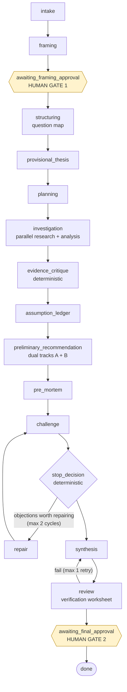
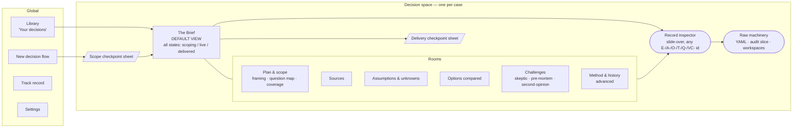
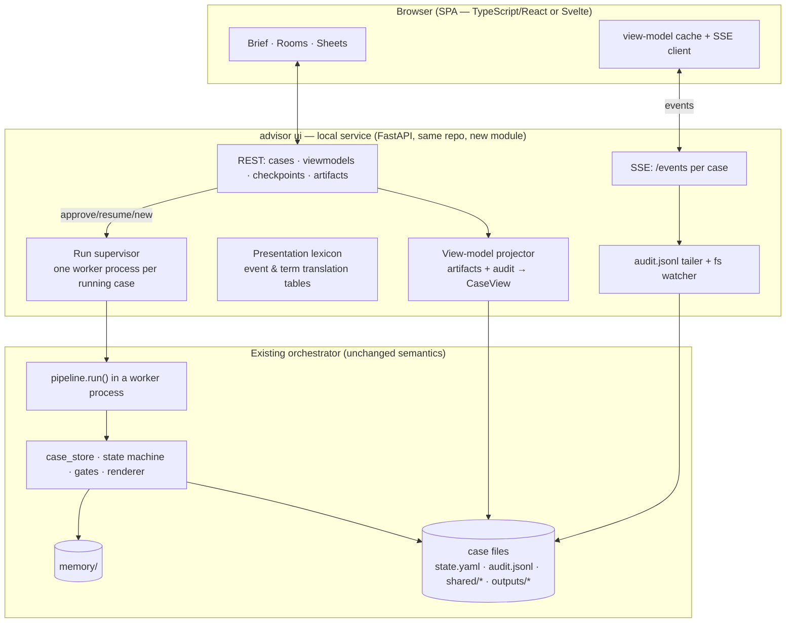

# AgentAdvisor — Frontend Discovery & Product-Design Report

**Prepared:** 2026-08-02 · **Basis:** full repository investigation (north star, 26 specs, orchestrator implementation, schema inventory, role definitions, two real case directories, four evaluation reports) plus external interaction-pattern research across decision-support, intelligence-analysis, forecasting, legal, and AI-product domains. · **Status:** design discovery — no implementation, no repository changes.

---

## 1. Executive summary

**What exists.** AgentAdvisor is a mature, headless decision engine: a deterministic 19-state pipeline that turns a fuzzy prompt into a framed decision, a MECE question map, graded evidence with provenance and independence tracking, an assumption ledger, quantitative scenario models, an adversarial challenge cycle (skeptic + pre-mortem + a second independent analytical track), and a final recommendation carrying four deliberately distinct uncertainty measures — all persisted as auditable YAML artifacts with an append-only event log. It works end-to-end today (five live scenarios, ~57 min and ~2.4M tokens per case). What it does not have is a single pixel of human interface: the two human approval gates the state machine parks at are satisfied today by auto-approve, and the intake role's clarifying questions have never been shown to a person. **The frontend is not a viewer for this system; it is the missing half of the product — the part that makes the consent moments real.**

**What the product should be.** After developing and comparing four genuinely different concepts — a document-centric *Commission*, a spatial *Inquiry Map*, a personified *Committee*, and a *Mission Control* console — the recommended direction is **"The Commission": each decision is one living advisory brief.** The user commissions it in plain language; a short interview asks the engine's real clarifying questions; a **scope checkpoint** presents the system's interpretation, its broadened options, and its investigation plan for signature (informed consent styled after an engagement letter, not a settings dialog). During the 40–90-minute run, the brief visibly assembles itself from real artifacts — sections settle in as evidence files, the working view updates as discrete explained revisions, margin narration translates the audit stream — and the user is explicitly free to leave (notifications distinguish *needs-you* from *ready*). Delivery is a second signature: an answer card with the four uncertainty measures in four non-interchangeable visual shapes, at most four ranked reasons, "this advice expires if…" tripwires, and an **integrity slip** that states plainly what the independent review verified, what stayed unresolved, and what was never assessed. Behind the brief sit five rooms — Sources, Assumptions, Options, Challenges, Method — and one universal gesture: *pull any thread*, from any claim down to the graded source excerpt. The Inquiry Map survives as the read-only "how I broke it down" view; the Committee survives as attributed desk bylines (THE SKEPTIC, SECOND OPINION) with their real doctrinal voices; Mission Control survives as the Method layer.

**The design's spine is honesty engineering.** The investigation surfaced realities the interface must be built *for*: a completed case whose independent review failed yet shipped as approved; coercion placeholders ("Model stability: 0.0% (0/1 runs)") rendered as measurements; seven objections all left open; evidence silently dropped by context truncation; a 52% per-attempt invocation success rate that makes retries normal metabolism. The design answers with hard rules: four uncertainty measures never share a widget or sentence (phrase + inline range, countable dots, k-of-n stress runs, labeled confidence bands); "not assessed" is a first-class state that can never render as a number; delivery integrity is derived from the review and gate artifacts, never from case state; disagreement between tracks is displayed as positions, never averaged; progress narrates only real events and names its silences.

**Technical shape.** A local-first web app: a small service layer in this repo (`advisor ui`) exposing a versioned `CaseView` projection, SSE liveness fed by tailing the per-event-flushed `audit.jsonl`, checkpoint POSTs that reuse SPEC-019's approve/resume semantics, and a supervisor owning one pipeline worker per case. Pydantic stays the single source of truth (schema export → generated TypeScript). The UI renders from structured YAML (never the rendered Markdown, whose renderer bug it thereby escapes) and can be built almost entirely against the existing StubBackend, fixtures, and replayed real-case audit logs — at zero token cost.

**What must happen first.** Seven small backend prerequisites gate full honesty: an approve/resume service surface, consumption of framing edits (today `edits` is written but never read), the budget-persistence fix (counters never persist, so effort meters and disclosed early-stops are currently inert), safe resume (zombie tasks, archive collisions), a persisted review-accepted flag, renderer fixes (citation spam, empty critical-assumptions, missing pre-mortem), and a `stage_started` event. Each is spec-sized in this repo's own process; §22 sequences them alongside four design-execution and three engineering steps, beginning with wireframes of the five load-bearing screens and a lay-reader comprehension test of the four-measure confidence panel — the single riskiest design element in the product.

---
## 2. What the product actually is

Strip away the implementation and AgentAdvisor is this:

> **You bring a hard, fuzzy, consequential decision. A small, disciplined analytical staff investigates it for about an hour — framing it properly, broadening your options, gathering graded evidence, surfacing the assumptions you didn't know you were making, attacking its own conclusion — and returns a recommendation you can interrogate down to the source excerpt, with its uncertainty stated honestly in four distinct ways.**

The north star names the experience precisely: *"commissioning a compact, transparent consulting engagement — not operating an agent framework"* (§15). The product's stated differentiator is not multi-agent orchestration; it is **the inspectable chain**: objective → alternatives → criteria → evidence → assumptions → scenarios → objections → recommendation (§3).

Three properties distinguish it from everything users will compare it to (ChatGPT, deep-research tools, human advisors):

1. **It is adversarial to itself, on the record.** A skeptic role attacks the thesis; a pre-mortem assumes the recommendation failed and writes the retrospective; two independent analytical tracks on different model families may disagree, and their disagreement is *reported, never averaged*. In the live corpus this machinery is real: case-002's tracks disagreed (staged investment vs. alternative vehicle, confidence 0.44 vs 0.55) and the divergence record says so verbatim.

2. **Uncertainty is plural and disciplined.** Outcome probability, evidence confidence, recommendation confidence, and model stability are four different quantities; collapsing them "is a defect" (north star §9). Probabilities carry an audit trail (reference class → base rate → cited adjustments → posterior) and prefer ranges over false precision. The deterministic verification layer literally blocks a recommendation whose confidence exceeds its evidence confidence by more than 0.25.

3. **The process leaves a paper trail a court would accept.** Every claim links to evidence records with provenance, limitations, and an independence group; every belief change is a numbered thesis revision with the IDs that caused it; every stage passes deterministic quality gates; a citation reviewer checks claims against actual excerpts; an append-only audit log records every invocation with model, tokens, and duration.

**What the product is *not*** (its own words, north star §4): not a chat room, not model voting, not a deep-research report with a recommendation appended, not a source of regulated financial advice, not an autonomous actor.

### The missing layer

Today all of this runs headless. There is no way for the intended user to start a case, answer the clarifying questions the intake role generates (in the benchmark runs those questions were *never shown to a human* — the gate was auto-approved), watch progress, approve the framing, or read the result outside a Markdown file in a directory tree. The backend is a mature decision engine with no product wrapped around it. The frontend is therefore not a "viewer" project; it is **the product's entire human interface, including the two consent moments the state machine already waits for**.

### One honest complication

The engine is good but not immaculate, and the interface must be designed for the engine that exists, not an idealized one. A full case takes 40–90 minutes and ~2.4M input tokens across ~41 agent invocations, of which roughly half fail validation and retry — normal metabolism, not exceptions. Real outputs contain degraded-data placeholders (a coerced "Model stability: 0.0% (0/1 runs)"), and the completed reference case shipped with its independent review failing and seven objections still open while the state machine recorded `final_approved: true`. A frontend that renders this system as a smooth oracle would be lying; a frontend that renders every seam as an error would be unusable. Making *partial, imperfect, honest* analysis feel trustworthy is the central design problem — and, done right, it is also the moat.

---

## 3. Target-user analysis

### 3.1 The primary personas

**P1 — The Owner (primary).** A non-technical person facing a personally consequential decision: accept the job offer, buy the condo or keep renting, put $25k into a friend's startup. The five benchmark scenarios in the repo are exactly this person's problems (equity timing, angel check, build-vs-buy, career switch, condo-vs-rent). Characteristics that drive design:

- **Episodic, not habitual.** A few genuinely hard decisions a year. Every session is close to a first session; the interface can assume no learned vocabulary, no muscle memory, no tolerance for configuration.
- **Emotionally loaded.** Decision anxiety is part of the state they arrive in. The product must be calming without being falsely reassuring — the worst outcome is manufactured certainty; the second worst is amplified dread.
- **Cannot audit the machinery.** Their trust must come from legible process, verifiable citations, and the system visibly arguing with itself — not from claims of sophistication.
- **Will act (or not) in the real world.** They need the "what would change this advice" and "next actions" content more than they need methodology. The recommendation competes with a phone call to a smart friend.

**P2 — The Operator.** A founder, small-business owner, or team lead making a defensible organizational call: build vs. buy, market entry, vendor selection. Semi-technical, time-poor. Differences from P1: they need to *re-present* the analysis to others (co-founder, board, spouse-as-CFO), so export and shareable structure matter; they will drill into evidence quality and alternatives because someone will challenge them; they may run several related cases and want cross-case memory.

**P3 — The Builder.** The repository's author and future power users: runs benchmarks, tunes budgets and models, inspects raw artifacts, files outcome records. P3 is served by an *advanced layer* (raw YAML, audit log, budget ledgers, gate internals) that must exist but must never leak into P1's default experience. P3 is also the only persona today — which is precisely why the design must resist defaulting to P3's needs.

### 3.2 What each persona needs from the same case

| Need | Owner | Operator | Builder |
|---|---|---|---|
| Plain-language recommendation with reasons | ●●● | ●●● | ●● |
| Honest uncertainty they can *feel* correctly | ●●● | ●●● | ●●● |
| Approve/adjust framing without jargon | ●●● | ●●● | ●● |
| Evidence quality at a glance | ●● | ●●● | ●●● |
| Drill to source excerpts | ● | ●●● | ●●● |
| Disagreement & objections legible | ●● | ●●● | ●●● |
| Raw artifacts, audit log, budgets | — | ● | ●●● |
| Export / share | ● | ●●● | ● |
| Track record over time | ● | ●● | ●●● |

The design question is not "which persona wins" but "how does one interface serve P1 by default while P2/P3 depth remains one intentional gesture away." That is the progressive-disclosure architecture of §12.

### 3.3 Trust formation (the real adoption problem)

For P1, the trust sequence the interface must engineer, in order:

1. **"It understood me"** — the intake plays their decision back in their own words, correctly, before anything runs.
2. **"It asks smart questions"** — the clarification questions the intake role already generates (deadline, risk tolerance, what they'd consider a loss) are exactly the questions a good human advisor asks first. Today they die unasked in a YAML file; in the product they are the second thing the user sees.
3. **"It didn't just answer — it pushed back"** — added alternatives they hadn't considered (the real case broadened 3 user options into 7), named assumptions they were silently making.
4. **"I watched it work honestly"** — progress narrated as real findings, including dead ends ("no independent source found for X").
5. **"It argues with itself"** — the skeptic's objections and the second track's dissent, presented as rigor rather than malfunction.
6. **"I can pull any thread"** — every claim opens to its sources; every number to its basis.
7. **"It tells me what would change its mind"** — falsifiability as a feature.
8. *(over months)* **"Its track record is visible"** — recorded outcomes and calibration, honestly gated by sample size.

Each stage of that sequence maps to a concrete screen or interaction in §13. Trust failures and their prevention are catalogued in §20.

### 3.4 Who this is not for

- People who want an instant answer (they should feel, within 30 seconds, that this is a *commissioned analysis*, not a chat reply — and be routed away politely if that's not what they want).
- Regulated advice seekers: the product must repeatedly and calmly disclaim that it is analysis, not licensed financial/legal advice — in the brief itself, not in fine print.
- Teams needing real-time collaboration (single-user by architecture today; §19 discusses futures).
## 4. Repository and workflow findings

Everything in this section was verified against the implementation (files under `orchestrator/`, `schemas/`, `cursor/roles/`), the specs (`specs/`), the evaluation reports (`report-and-findings/`), and two real case directories. It is organized as: what the engine does, what it produces, what is observable, and what is broken or missing — because each category constrains the frontend differently.

### 4.1 The pipeline as the user will experience it

The case state machine (`orchestrator/state_machine.py`) has 19 states — 17 active stages plus `done`/`failed` — with exactly two human gates:



Facts that shape the UX:

- **The gates park the process indefinitely.** `run_case` simply *returns* when an approval flag is false; some external actor must set the flag and re-invoke the pipeline. The frontend owns this moment entirely.
- **Two bounded loops exist** — repair (`stop_decision → repair → challenge`, max 2 cycles) and re-synthesis (`review → synthesis`, max 1 retry). Users will see stages repeat; the UI must present this as "follow-up work," not regression.
- **Two stages are agentless and near-instant** (evidence critique, stop decision — pure Python), while investigation (~36 min of researcher time) and analysis (~45 min) dominate wall clock. Progress pacing must reflect this asymmetry.
- For lay presentation, the 17 stages compress naturally into **six phases**: Scoping (intake+framing), *Checkpoint 1*, Mapping (structuring+provisional thesis+planning), Investigating (investigation+critique+assumptions), Stress-testing (preliminary rec+pre-mortem+challenge+repair+stop), Drafting & checking (synthesis+review), *Checkpoint 2*.

### 4.2 The roles, as material for the product

Fourteen role definitions exist (`cursor/roles/*.md`), each with a model assignment and projection config. What matters for the frontend is that the roles have **genuine, quotable epistemic stances** the product can surface as its personality:

| Role | Stance (from its own instructions) |
|---|---|
| Intake | Anti-fabrication scribe: unknown fields are `null` + a clarifying question, never a guess |
| Director (framing) | Anti-anchoring: must broaden the alternative set before research; fills gaps with *declared* defaults, "do not claim the user stated those defaults" |
| Structurer | "A shallow tree produces a shallow answer no matter how good the downstream work is"; every question needs resolution criteria or "the node does not belong in the tree" |
| Researcher | "Five outlets reporting one company press release are one group"; "an honest empty result is useful decision input; a fabricated record is a poisoned one" |
| Analyst | "Every number… must come from the executed script output. No prose arithmetic, ever" — outputs are re-executed and diffed |
| Assumption analyst | "You are not summarizing what the case says. You are finding what it takes for granted" |
| Director B (second track) | Blind to track A: "You have not been shown the other track's conclusion… Do not hedge toward a presumed consensus" |
| Pre-mortem | "The Challenger attacks the reasoning as it stands. You accept the reasoning and attack the world it will meet… Do not soften." |
| Challenger | "Manufactured disagreement is prohibited"; every objection carries the evidence that would *reverse* it |
| Synthesizer | "Averaging agent opinions is forbidden… Unresolved disagreement must be reported as unresolved" |
| Reviewer | "Judge support, not plausibility… Finding real defects is the expected result on a first pass"; may never edit the recommendation |
| Auditor | Process-only: drift, duplication, mandate violations; feeds the stop decision |

These lines are better product copy than anything a marketing pass would invent; §14 and §15 use them as the voices of the "desks."

### 4.3 The data surface (what screens can be made of)

Every artifact is a schema-validated YAML file inside `cases/<case-id>/` (plus one JSONL audit log and one rendered Markdown). Pydantic models in `orchestrator/artifacts/` are the source of truth; 35 JSON Schemas are pre-exported to `schemas/` (regenerated via `make schemas`). Stable ID prefixes stitch everything together: `E-` evidence, `A-` assumptions, `T-` tasks, `O-` objections, `Q-` question-tree nodes, `VC-n` verification items.

The structures richest in UI value, ranked:

| Structure | On disk | What a UI can build from it |
|---|---|---|
| `FinalRecommendation` (16 fields) | `outputs/final_recommendation.yaml` | The entire deliverable: action + timing, ranked alternatives with rationale, key reasons, scenario probabilities (point *or* interval, with base-rate → cited-adjustment audit trails), counterarguments with `resolved: bool`, change triggers, next actions, four uncertainty measures |
| `EvidenceCritique` | `shared/evidence_critique.yaml` | Deterministic source-quality dashboard: per-record authority score (inspectable formula: tier×0.5 + reliability×0.2 + directness×0.2 + recency×0.1), independence clusters with share-of-corpus, `primary_source_share`, flags (`stale`, `single_source_cluster`, …) |
| `ThesisRevision` ledger | `shared/thesis/thesis-NNN.yaml` | "How the working view changed": append-only revisions with trigger, changed-because IDs, and both confidences — a ready-made belief timeline (real case: confidence climbed 0.28→0.42 across three revisions, with one of the user's own options eliminated on a verified fact) |
| `IssueTree` + coverage | `shared/issue_tree.yaml` | Guaranteed-valid single-rooted tree (8–16 nodes, each with resolution criteria) + `covered_share` — the only *structural* progress metric in the system |
| `TrackDivergence` | `shared/track_divergence.yaml` | Two positions from different model families, `agreement: bool`, prose divergence summary — explicitly "reported, not averaged" |
| `PreMortemReport` | `shared/premortem_report.yaml` | ≤5 failure modes, each with narrative, probability, severity, leading indicators, preventive action → a probability×severity risk view whose indicators feed change-triggers |
| `AssumptionRecord` | `shared/assumptions/A-*.yaml` | Type × status × materiality ledger with `evidence_for` / `evidence_against` splits and per-assumption probability estimates |
| `ObjectionRecord` | `shared/objections/O-*.yaml` | Challenge board: materiality, resolution status, target section, reversal evidence, commissioned repair tasks |
| `GateReport` per stage | `shared/gates/<stage>.yaml` | Pass/warn/block quality checks with typed `check_id`s and target IDs — the integrity strip |
| `VerificationWorksheet` + `ReviewReport` | `shared/verification_worksheet.yaml`, `outputs/review_report.yaml` | Claim ↔ evidence-excerpt ↔ verdict table (≤8 items); pass/fail with typed defects |
| `AuditEvent` stream | `audit.jsonl` | The only chronological record: ~123 events/case with actor, model, tokens, duration — activity feed, cost meter, and attribution joiner |
| Memory digests | `shared/case_memory_digest.yaml`, `prior_evidence_digest.yaml` | Prior similar cases, source reputations, recurring assumptions, Brier calibration (sample-size-gated) — each carrying a mandatory "context, not citable" banner |

Cross-cutting contracts a frontend must honor:

- **`ProbabilityEstimate` is point XOR interval** — render a number or a range, never guess.
- **`ModelStability` is self-consistent** (`share == runs_supporting/runs_total`) — render "19 of 25 runs," never a bare gauge.
- **Degraded-data sentinels are detectable**: confidence `basis: "Not independently assessed"`, `runs_total == 1`, and coercion-substituted values must render as *not assessed*, never as measurements.
- **Attribution requires a join**: most artifacts carry no author/timestamp; the audit log's `id_mapping` payloads connect canonical IDs back to the invocation that produced them.

### 4.4 What is observable during a run

The engine's observable surface, ranked by usefulness:

1. **`audit.jsonl`** — appended and flushed per event; the intended live feed (~25 event types incl. `task_started/completed`, `role_invocation_attempt` with status/tokens/duration, `stage_completed`, `stage_gate_evaluated`, `thesis_revision_recorded`, `*_batch_unpacked` with counts).
2. **Task record status flips** (`shared/tasks/T-*.yaml`: planned→active→completed).
3. **Artifacts appearing** in bursts at task completion.
4. **`state.yaml`** — one write per stage boundary, minutes apart.
5. **Runtime workspace existence** (`~/.local/share/agentadvisor/workspaces/<case>/<role>--<task>/`) — "this agent is working right now."

**What is not observable:** anything *inside* an invocation. Agent stdout surfaces only after process exit; an analyst call can be 10 silent minutes. There is also **no `stage_started` event** (the largest observability gap — inferable, but worth adding). The design consequence is fundamental: progress granularity is **per-event, minutes apart** — which suits narrated, artifact-driven progress and rules out token-streaming theater. Retries are internal to a 3-attempt ladder (default, default, escalation model) with workspaces rebuilt per attempt and failures archived; at a measured **52% per-attempt success rate**, retries are metabolism, not incidents.

### 4.5 Cost and duration reality

From the five live end-to-end scenarios (2026-08-02 evaluation) and the real case audit logs:

| Metric | Reality |
|---|---|
| Wall clock per case | 40–81 min (avg ~57) |
| Agent invocations | ~41 per case (52% attempt success; ladder absorbs the rest) |
| Tokens | ~2.4M input / ~0.4M output per case (12–24k overhead *per invocation*) |
| Longest stages | Analyst ~45 min, researcher ~36 min; "thinking" roles are ~1 min each |
| Artifact volumes | 8–37 evidence records, 6–7 objections, 0–7 analysis results, ~7 assumptions (post-Phase-6), 3 thesis revisions, ~123 audit events |
| Hard external limit | Cursor Pro monthly usage cap — one evaluation round died on it mid-project |
| Quality scores | 1.89/2.0 average across 6 rubric dimensions; evidence quality weakest (1.53) |

### 4.6 Approval mechanics as implemented (and their gaps)

What exists: the state machine checks two booleans (`framing_approved`, `final_approved`) in `state.yaml`; SPEC-019 (draft) defines the intended CLI contract (`advisor new/status/approve/resume/report/list`); `FramingApproval` supports `decision: approve | edit | answer_clarifications` with `edits` and `clarification_answers` payloads; `IntakeRecord` carries up to five materiality-justified clarification questions.

What does not exist yet — **the frontend's backend prerequisites**:

1. **Nothing consumes `edits` or `clarification_answers`.** Writing `decision: edit` changes nothing; only the boolean advances the case. A real Gate 1 needs a framing-revision path (re-run framing with the user's edits/answers projected in).
2. **No rejection path.** `awaiting_framing_approval` transitions only to `structuring` or `failed`.
3. **The clarification questions are never asked.** In every run to date the gate was auto-approved; the questions died in YAML. The frontend is the first component that will actually deliver this designed-but-dormant interaction.
4. **`advisor approve` / `resume` / any API**: not implemented (no `cli.py`, no server, no entry points).

### 4.7 Integrity realities the UI must design for (not around)

These were all observed in the completed reference case (case-001, 84.6 min, done/approved):

- **`done` ≠ verified.** The review failed twice (6→2 unsupported citation verdicts across one allowed retry, plus deterministic BLOCK findings for three undisclosed open objections) — and the pipeline then advanced to approval and `done` anyway. The UI must derive a **delivery-integrity status** from `review_report.yaml` + gate reports, independent of case stage.
- **All 7 objections ended `open`;** three high-materiality ones appear nowhere in the final document.
- **A coercion placeholder shipped as a measurement**: "Model stability: 0.0% (0/1 sensitivity runs)" — the `runs_total==1` sentinel rendered as if it were data, beside a 58% recommendation confidence.
- **`critical_assumptions` was empty** in the final YAML despite 7 assumption records (3 high-materiality) on the blackboard — the linkage is broken upstream.
- **The rendered Markdown has a citation-spam bug** (the full case citation list appended to every bullet — ~40% of the document): the *YAML is clean*; the UI must render from structured artifacts, not parse the Markdown.
- **Context truncation silently dropped 6 of 18 evidence records** from synthesis (per-invocation 20,000-char projection budget); several roles self-reported truncated inputs.
- **`independence_group` keys embed the research question**, so the same publisher across two questions forms two "independent" groups — concentration is systematically understated, and the raw slugs are user-hostile.
- **`budget_counters` never persists** (aliasing bug: always `{}` in `state.yaml`), so budget exhaustion detection and the disclosure record are currently inert; usage must be computed from `audit.jsonl`. Wall-clock and research-task caps are dead config.
- **Resume is not idempotent**: killed runs leave zombie `active` tasks that never re-dispatch; re-running a stage collides with archived workspaces (`FileExistsError` → case `failed`) and re-mints duplicate `E-/O-/A-` IDs.
- **Failed agents inside tasks are recorded as `completed` with no artifacts** — real failure is only visible in `role_invocation_attempt` audit statuses.

None of these are reasons to soften the product; they are reasons the interface's honesty machinery (integrity strip, "not assessed" states, disclosure surfaces) is load-bearing rather than decorative. They also define the **backend hardening list** in §22.

### 4.8 What the repo has already decided about the frontend

- SPEC-019 scopes a plain CLI (approve/status/resume/report) and explicitly defers "Web UI, TUI dashboards, artifact browsing" — a web UI was "not required for *MVP done*," not rejected.
- North star §21.12 leaves open "which parts of the workflow benefit from a visual interface versus plain Markdown artifacts" — this report is the answer to that question.
- The north star's §15 experience contract (interpretation → approval → plan → meaningful progress → recommendation → inspectable chain) *is* a frontend specification in prose, and the state machine was built to pause where it says the user acts.
- Development can run against `StubBackend` (scripted role results replaying a full pipeline) — meaning the frontend can be built and demoed **without spending a single model token**, against fixtures that already exist (`tests/fixtures/artifacts/`, two real case directories).
## 5. UX challenges

The twelve hard problems this design must solve, ranked roughly by how much they shape the architecture.

**C1 — A 40–90 minute latency with two consent moments in the middle.** The product's rhythm is unlike chat (seconds) or deep research (minutes, no interruption): minutes of user input → a long autonomous run that *pauses and waits, indefinitely, for human approval* → consumption that may last days. The interface is really three sub-products — commissioning, the wait, the deliverable — and the wait must be safe to walk away from (notification on gate-reached and on delivery, reattach on return, resume after laptop-close).

**C2 — Four uncertainty measures for people who conflate one.** Outcome probability, recommendation confidence, evidence confidence, and model stability must each be *felt* differently by a lay reader, when decades of research say even one probability is routinely misread. This demands distinct visual encodings, a fixed verbal vocabulary with inline ranges, and contextual teaching — without turning the brief into a statistics lesson.

**C3 — Honesty about degraded and partial data.** Real cases contain: coercion placeholders masquerading as measurements ("Model stability: 0.0% (0/1 runs)", confidence basis "Not independently assessed"), evidence dropped by context truncation, a review that failed on the final attempt while the case shipped, and seven objections all still open. The UI must detect these states (the sentinels are identifiable) and render them as what they are — *not assessed*, *incomplete*, *delivered with reservations* — without either hiding them or turning the product into an error console.

**C4 — Progressive disclosure across a 100× depth range.** The same case must read as five sentences (Owner, phone, 60 seconds) and as 18 evidence records + 7 analysis scripts + 123 audit events (Builder, desktop, an hour) — without the shallow layer feeling like a toy or the deep layer feeling like a filesystem.

**C5 — Making adversarial content feel like rigor, not malfunction or noise.** Objections, pre-mortem failure narratives ("the position never recovered"), and inter-track disagreement are the product's soul, but presented wrong they read as "the AI is arguing with itself / scaring me." They need framing (why this makes the advice safer), visual distinction from the recommendation, and explicit resolution status.

**C6 — Framing revision that doesn't feel like editing machine configuration.** At Gate 1 the user must be able to correct the interpretation, answer clarifying questions, strike or add alternatives, and set risk tolerance — all edits that land in a `FramingApproval` artifact — while experiencing it as *marking up a shared understanding*, never as filling in a schema.

**C7 — Progress without theater and without logs.** The only honest signals during a run are per-invocation: audit events, task status changes, artifacts landing. There is no token-level stream. The design must narrate these real events in human language, tolerate a 52% per-invocation retry rate silently (stage-level health only), show coarse time expectations (the longest stages are research ~36 min and analysis ~45 min), and never fake granularity it doesn't have.

**C8 — Budget exhaustion and early stops as first-class honest states.** Real runs have died on a monthly usage cap; the stop-decision machinery can end a case with disclosed reasons ("investigation budget exhausted"). The UI must present "we stopped early, here is what remains unexplored" as a respectable deliverable state, not a failure screen — the `DisclosureRecord` exists precisely for this.

**C9 — Empty and sparse states that tell the truth.** Early in a run most rooms are empty; some cases legitimately produce no assumptions or thin evidence (one benchmark produced 8 records where siblings produced 30+). "Not investigated yet," "investigated, nothing found" (`no_evidence_found` is a first-class outcome), and "dropped for budget" are three different truths needing three different empty states.

**C10 — Local-first operations.** The engine runs on the user's machine (Cursor CLI subprocesses); the laptop lid closes mid-run; the app restarts. Reattachment, checkpoint/resume, and "a case is never lost" must be design guarantees, and their UX (a calm "resume where we left off" banner) is part of trust.

**C11 — Vocabulary translation with zero leakage.** Thirteen role names, stage enums, artifact types, and IDs like `Q-1.4.2` are all one accidental tooltip away from destroying the consulting-engagement fiction. The terminology system (§14) must be total: every string a user can ever see has a product-language form.

**C12 — Text-heavy truth vs. visual decoration.** Nearly everything the engine produces is prose + structured YAML. The temptation is decorative dashboards; the discipline is that every visualization must carry decision information that prose can't (rankings, spreads, coverage, disagreement) — and the brief remains the spine.
## 6. External product and interaction research

Research was conducted across two families of products: pre-AI decision-making domains (intelligence analysis, forecasting, legal discovery, consulting deliverables, clinical consent) and AI-era products (deep-research tools, agent workspaces, AI notebooks). The goal was to extract *specific interaction patterns*, not product inspiration. Each pattern below names the source, the mechanism, and what AgentAdvisor should take from it.

### 6.1 Patterns to borrow — commissioning & approval moments

| # | Pattern | Source | Mechanism | What AgentAdvisor takes |
|---|---------|--------|-----------|--------------------------|
| 1 | **Editable plan as the launch gate** | Gemini Deep Research | Generates a visible multi-step research plan card and *stops*; user edits in natural language or approves; only approval starts the long run ([support.google.com](https://support.google.com/gemini/answer/15719111)) | The framing gate is a readable, editable plan document — never a settings dialog |
| 2 | **Clarify, then restate** | OpenAI Deep Research | Asks a short batch of clarifying questions, then restates the research direction for correction before committing ([openai.com](https://openai.com/index/introducing-deep-research/)) | Intake asks few, targeted questions, then plays the decision back in its own words |
| 3 | **Plan as editable document, not modal** | Cursor Plan Mode | The plan is a Markdown document with to-dos the user edits inline; run starts on approval ([cursor.com/blog/plan-mode](https://cursor.com/blog/plan-mode)) | Gate 1 approval is co-authorship: strike a sub-question, add a consideration, reword an alternative |
| 4 | **Read-back / per-item confirmation** | Aviation checklists; surgical teach-back ([Degani & Wiener](https://users.cs.northwestern.edu/~robby/courses/395-495-2017-winter/checklists/Degani%20Human%20Factors%20of%20Flight-Deck%20Checklists%20The%20Normal%20Checklist.pdf); [Patient Safety in Surgery](https://link.springer.com/article/10.1186/s13037-022-00322-z)) | Critical items confirmed individually in short chunks, not one global "Approve" | The scope checkpoint confirms the high-stakes items one by one ("Treating X as out of scope — correct?") |
| 5 | **Review queue with coding panel** | Relativity privilege review ([relativity.com](https://www.relativity.com/blog/advice-on-transforming-e-discovery-with-ai-powered-first-pass-and-priv-review/)) | One item at a time plus a fixed accept/edit/reject panel; decisions re-rank the queue | Intake questions and material assumptions are reviewed as a short card queue, not a wall of form fields |
| 6 | **Resolution criteria above the fold** | Metaculus / Polymarket ([docs.polymarket.com](https://docs.polymarket.com/concepts/resolution)) | The precise definition of "what counts as the event happening" is the most prominent content | The scope checkpoint leads with "this analysis will answer exactly: …" — that sentence is what the user approves |

### 6.2 Patterns to borrow — the long run

| # | Pattern | Source | Mechanism | What AgentAdvisor takes |
|---|---------|--------|-----------|--------------------------|
| 7 | **Stage checks, logs one click down** | GitHub Actions / Vercel deploys ([vercel.com](https://vercel.com/docs/deployment-checks)) | Named stages with pending/pass/fail icons; detail grouped behind a click; never a percentage | The run is a checklist of named phases; per-phase detail is available but not ambient |
| 8 | **Deliverable-first monitoring** | GitHub Copilot coding agent's draft-PR workflow ([github.blog](https://github.blog/news-insights/product-news/github-copilot-meet-the-new-coding-agent/)) | The agent works *inside* the artifact (a draft PR); activity log attaches to the artifact, not vice versa | Users watch the recommendation brief assemble itself; the activity feed is an annex to the document |
| 9 | **Live activity narration + counters** | OpenAI Deep Research; Perplexity ([openai.com](https://openai.com/index/introducing-deep-research/)) | Human-readable sentences of current activity plus running counters (sources consulted); raw reasoning hidden | Narrated progress lines ("Comparing salary data across three sources") + counters (sources found, claims checked) |
| 10 | **Checklist + coarse ETA + "Notify me"** | Perplexity Labs ([datacamp.com](https://www.datacamp.com/tutorial/perplexity-labs)) | Steps complete in real time; remaining-time estimate; explicit permission to leave | Coarse time ranges ("20–40 min remaining"), an explicit "You can leave — we'll notify you" affordance |
| 11 | **Two notification classes** | Claude Code mobile push; Deep Research completion notices | "Needs your input" and "result ready" are distinct events | Gate-reached and brief-ready notifications are separate, differently urgent channels |
| 12 | **Named lenses instead of one log** | Devin's Progress/Shell/Browser/Editor panes ([docs.devin.ai](https://docs.devin.ai/release-notes/2025)) | Familiar frames replace a unified trace | During the run, tabs like Questions / Sources / Challenges are curated lenses, not logs |

### 6.3 Patterns to borrow — evidence, probability, disagreement

| # | Pattern | Source | Mechanism | What AgentAdvisor takes |
|---|---------|--------|-----------|--------------------------|
| 13 | **Two-axis evidence grading** | Admiralty/NATO system ([SANS](https://www.sans.org/blog/enhance-your-cyber-threat-intelligence-with-the-admiralty-system)) | Source reliability (A–F) and information credibility (1–6) graded independently ("B2") | Evidence badges separate *source quality* from *corroboration*; one mushy star rating is banned |
| 14 | **Click-to-passage citations** | NotebookLM ([codecademy.com](https://www.codecademy.com/article/how-to-use-notebooklm)) | Inline numbered citations open the exact source passage | Drill-down terminates at a highlighted excerpt with provenance, never at a bare URL |
| 15 | **Claim × evidence table** | Elicit ([journals.sagepub.com](https://journals.sagepub.com/doi/10.1177/08944393251404052)) | Sources as rows, questions as columns, every cell sentence-cited | The evidence explorer offers a compact sources × (finding, grade, relevance) table per question |
| 16 | **Stance-labeled badges** | Scite; Consensus Meter ([scite.ai](https://scite.ai/badge); [help.consensus.app](https://help.consensus.app/en/articles/10069920-the-consensus-meter)) | Supporting / mentioning / contrasting counts; quality snapshot across recency, methods | Counter-evidence is visible at a glance; "supports / contests" is a first-class chip on every evidence card |
| 17 | **Calibrated words + inline ranges** | ICD 203; Wintle et al. ([intelligence.gov](https://www.intelligence.gov/assets/documents/intelligence-community-directives/ICD_203.pdf); [PMC7971511](https://pmc.ncbi.nlm.nih.gov/articles/PMC7971511/)) | Fixed phrase→range vocabulary; the winning format embeds the range: "likely [55–80%]" | House style for every estimate: one fixed vocabulary, phrase + bracketed range, everywhere |
| 18 | **Likelihood ≠ confidence, structurally** | ICD 203 ([factually.co](https://factually.co/fact-checks/politics/how-icd-203-intelligence-analytic-standards-confidence-levels-work-why-they-matter-1d3959)) | Probability of the event and confidence in the analysis are banned from the same sentence | Two visually distinct slots; the four uncertainty measures never share an encoding |
| 19 | **Frequency-framed probability widgets** | Quantile dotplots, CHI 2016/2018 ([mjskay.com](https://www.mjskay.com/papers/chi2018-uncertain-bus-decisions.pdf)) | "28 of 100 dots" displays are countable; reduced variance and better decisions for lay users | Default probability widget is countable (dots / "x in 100"); density curves are expert-only |
| 20 | **Fan charts with labeled bands** | Consumer Monte Carlo planners ([Boldin](https://help.boldin.com/en/articles/5805671-boldin-s-monte-carlo-simulation)) | Percentile bands labeled in plain language ("90% of simulations ended above this") | Quantitative projections use labeled fans with gradient edges |
| 21 | **Disagreement as visible spread** | Metaculus aggregate + individual dots ([metaculus.com](https://www.metaculus.com/)) | Individual forecasts plotted under the aggregate; disagreement seen, not averaged away | The two analytical tracks' positions are plotted as separate marks; divergence is displayed, never blended |
| 22 | **Rationale attached to every number** | Good Judgment ([goodjudgment.com](https://goodjudgment.com/services/custom-superforecasts/)) | Every probability carries written reasoning and update history | Every estimate has an expandable "because…", every revision a timestamped reason |
| 23 | **Facts as objects linked to exhibits** | Everlaw Storybuilder ([support.everlaw.com](https://support.everlaw.com/hc/en-us/articles/42469701435803-Storybuilder-Fact-Timelines)) | Narrative facts link by ID to underlying documents; one-click pivot from story to source | Every claim in the brief is an object that pivots to its graded evidence records |
| 24 | **Impact-sorted argument trees as drill-down** | Kialo; IBIS ([digitaled.ie](https://www.digitaled.ie/a-review-of-kialo-a-tool-for-teaching-critical-thinking-and-rational-debate/)) | Pro/con nested under a thesis, sorted by rated impact | Objections sort by materiality; the strongest counterargument is always on top — but trees stay behind the answer, never in front |
| 25 | **Pre-mortem as a named, separate artifact** | Klein ([nesslabs.com](https://nesslabs.com/pre-mortem-anticipate-failure-with-prospective-hindsight)) | "Assume it failed — what killed it?", written in past tense, kept distinct | A separate "If this fails, here's why" section in past tense — visibly not blended into the recommendation |
| 26 | **Reason-code discipline** | Credit adverse-action notices ([consumerfinance.gov](https://www.consumerfinance.gov/compliance/circulars/circular-2022-03-adverse-action-notification-requirements-in-connection-with-credit-decisions-based-on-complex-algorithms/)) | Regulation limits explanations to the few *principal* reasons; >4 stops helping | The recommendation headline carries at most 3–4 ranked reasons, each drillable |
| 27 | **Answer-first pyramid + load-bearing appendices + decision record** | Minto; Amazon 6-pagers; Cloverpop ([managementconsulted.com](https://managementconsulted.com/pyramid-principle/); [cloverpop.com](https://www.cloverpop.com/decision-intelligence-platform)) | Governing thought first, grouped arguments, evidence at the base; a persistent record of what was decided and expected | The brief's information architecture; an exportable decision record capturing the user's own expectations, feeding later calibration |
| 28 | **Track-record / calibration page** | Metaculus calibration curves ([metaculus.com](https://www.metaculus.com/questions/3369/what-should-be-addedchanged-in-the-track-record-page/)) | Predicted vs. realized frequency, with sample sizes | Once outcomes are recorded, an honest "how well have my estimates resolved" page (Brier data already exists in the backend) |
| 29 | **Chat as engine, document as dashboard** | ChatGPT Canvas / Claude Artifacts ([skywork.ai](https://skywork.ai/blog/chatgpt-canvas-comprehensive-guide-2025-everything-you-need-to-know/)) | Persistent document owns state; chat is the control channel | Post-delivery Q&A happens beside the stable brief and highlights the passages it cites |
| 30 | **Diagnostic evidence surfaced first** | ACH software ([pherson.org](https://pherson.org/wp-content/uploads/2013/06/06.-How-Does-ACH-Improve-Analysis_FINAL.pdf)) | The tool highlights which evidence actually discriminates between hypotheses | "What would change this recommendation" leads with the 2–3 most diagnostic items; the full matrix is expert drill-down |

### 6.4 Patterns that would be harmful

| Anti-pattern | Source of the lesson | Why it fails here |
|---|---|---|
| **Live-updating point gauges ("the needle")** | NYT election needle backlash ([CJR](https://www.cjr.org/special_report/2018-midterms-forecasts-538-cnn-times-needle.php)) | Jitter meant as uncertainty reads as real-time signal; produces anxiety and lasting distrust. Never stream a fluctuating recommendation estimate mid-run; reveal estimates as discrete, explained revisions |
| **Crisp interval boundaries** | Hurricane cone "containment effect" ([Yale](https://climatecommunication.yale.edu/publications/misinterpretations-of-the-cone-of-uncertainty-in-florida)) | Inside=danger/outside=safe misreading; explanation does not cure it. Use gradient edges and discrete samples |
| **One bare success score** | Retirement "probability of success" critique ([Kitces](https://www.kitces.com/blog/monte-carlo-retirement-projection-probability-success-adjustment-minimum-odds/)) | Users read 85% as an exam grade and ignore severity of failure. Always pair likelihood with downside magnitude |
| **Bare verbal probabilities** | Meta-analysis of verbal probability interpretation ([researchgate](https://www.researchgate.net/publication/362756464_The_Interpretation_of_Verbal_Probabilities_A_Systematic_Literature_Review_and_Meta-Analysis)) | "Likely" spans ~25–90% across readers. Phrase must carry its range |
| **Matrix-first analysis UI** | Standalone ACH tools' stagnation ([FOI](https://www.foi.se/download/18.7fd35d7f166c56ebe0bffd5/1542623691441/A-tool-for-generating_FOI-S--4390--SE.pdf)) | Grids are expert instruments; cognitively heavy as a landing view |
| **Unbounded debate trees as primary nav** | Kialo critique ([criticalfallibilism.com](https://criticalfallibilism.com/kialo-and-indecisive-arguments/)) | Trees fragment reasoning and never conclude. Answer first; tree behind |
| **Labor-illusion progress theater** | AI loading-state guidance ([uxpatterns.dev](https://uxpatterns.dev/patterns/ai-intelligence/ai-loading-states)) | One detectable fake step poisons an auditability product |
| **Determinate percent bars / precise ETAs** | CI practice; agent variance | A stalled "73%" is worse than stage checkmarks. Coarse ranges only |
| **Single undifferentiated confidence chip** | Radiology AI display research ([S3050577125000441](https://linkinghub.elsevier.com/retrieve/pii/S3050577125000441)) | Score-without-meaning is the main trust destroyer; also: flag only validated extremes loudly, support explicit deferral |
| **Chat-only delivery of the deliverable** | Why Canvas/Artifacts exist | A recommendation streamed into scrollback dies there. The brief is a persistent document |
| **Raw traces as "transparency"** | LangSmith's own pivot to AI-summarized traces ([langchain.com](https://www.langchain.com/langsmith/observability)) | Performs transparency while delivering noise |
| **Consent-banner gates; auto-proceed on timeout** | Cookie-banner blindness | Click-through converts consent to fiction. Gates must engage with content and wait indefinitely |
| **Instant-answer framing** | Rationale (Jina) ([rationale.jina.ai](https://rationale.jina.ai/)) | "Structured analysis in seconds" signals shallowness and invites over-trust — the anti-product |

### 6.5 Constraints from uncertainty-visualization research

1. **Interval boundaries are read categorically, and instructions don't fix it** ([Padilla, Kay & Hullman 2020](https://friendly.github.io/6135/papers/Uncertainty_Visualization_Padilla_Kay_Hullman_2020.pdf)). Prefer gradient/fade edges or discrete samples over crisp CI outlines.
2. **Discrete/frequency formats beat densities for lay users** (quantile dotplots: ~1.15× lower estimate variance, better real decisions — [Kay et al. CHI 2018](https://www.mjskay.com/papers/chi2018-uncertain-bus-decisions.pdf)). Countable displays are the default.
3. **Verbal phrases need embedded numbers** ([Wintle et al.](https://pmc.ncbi.nlm.nih.gov/articles/PMC7971511/)). "Likely [55–80%]" is the house format.
4. **Gradient/violin encodings reduce the cliff effect at thresholds** ([Helske et al., IEEE TVCG](https://arxiv.org/abs/2002.07671)). Never color-flip a display when an estimate crosses a decision threshold.
5. **Mean-plus-error-bar displays trigger within-the-bar bias** ([Padilla et al.](https://friendly.github.io/6135/papers/Uncertainty_Visualization_Padilla_Kay_Hullman_2020.pdf)). Avoid whiskered bars for uncertain quantities; use dotplots, gradient intervals, labeled fans.

### 6.6 Direct competitors (2024–2026)

- **Rationale (Jina AI)** — instant multi-framework analysis (SWOT, pros/cons) with "probabilistic outcomes." Zero evidence trail, seconds-deep. It is the cautionary opposite: AgentAdvisor's value is precisely what it skips. ([rationale.jina.ai](https://rationale.jina.ai/))
- **decisionMe (2025)** — guided life/business decisioning marketing "bias removal"; watch its guided-flow onboarding. 
- **DiscernAI (iOS, 2025)** — options plus user-weighted criteria producing a personalized recommendation; the *user-owned weights* input pattern is worth adopting at the framing checkpoint; its opaque post-hoc scoring is the thing to avoid.
- **SkillWee** — "simulate outcomes before acting"; validates scenario/pre-mortem framing as a consumer-legible concept.
- **Functional competitors: the deep-research products themselves** (OpenAI, Gemini, Perplexity, Claude Research). They set user expectations for progress narration and citations — but produce *reports*, not *decisions*: no graded evidence ledger, no adversarial challenge, no outcome probabilities, no mid-run consent. AgentAdvisor's differentiation is exactly the parts none of them ship.
## 7. Design principles

Ten principles, each derived from the product thesis, the research, or an observed failure mode. They are decision rules, not slogans — every screen spec in §13 can be checked against them.

**DP1 — The brief is the product; everything else annotates it.**
The user commissioned an answer, not a workspace. One continuously identifiable document — the advisory brief — is the case's center of gravity from first framing to final delivery. Maps, tables, boards, and feeds exist as *ways into* the brief, never as rival destinations. (Research basis: deliverable-first monitoring per the Copilot draft-PR pattern; Minto answer-first structure; chat-as-engine/document-as-dashboard.)

**DP2 — Consent, not configuration.**
The two checkpoints are informed-consent moments styled after engagement letters, not settings dialogs: the system states what it understood, what it will do, what it will cost, and what it cannot know; the user corrects it in their own words and signs. Per-item read-back for high-stakes items; no auto-proceed, ever; the signed record becomes a visible part of the case file. (Aviation read-back; Gemini editable-plan gate; anti-pattern: consent-banner blindness.)

**DP3 — Four numbers, four shapes.**
Outcome probability, recommendation confidence, evidence confidence, and model stability never share an encoding, a sentence, or a widget. Probability = countable frequency displays and phrase+range wording ("likely [55–80%]"). Confidence = labeled ordinal bands with basis text. Stability = "held in k of n stress runs." Evidence = graded chips with source-mix breakdowns. Collapsing them is a defect by product law (north star §9) — the UI makes the collapse *impossible*, not just discouraged.

**DP4 — Show the seams.**
Retries, empty results, truncation, unresolved objections, failed verification, budget stops, and "not assessed" placeholders are rendered as first-class honest states — calmly, with explanations, never as errors and never hidden. A case delivered with reservations *says so at the top*. The interface's credibility budget is spent nowhere else. (Radiology-AI deferral pattern; the observed done-but-review-failed case.)

**DP5 — Progress is real work made legible.**
Every progress element is driven by an actual event or artifact (audit events, task completions, sections landing). Narration is factual and past-tense ("Compared salary data across three sources"), counters are real, time estimates are coarse ranges, and nothing animates that isn't happening. If the engine is silent for eight minutes inside an analyst run, the UI says exactly that. (CI stage semantics; labor-illusion research; no-token-streaming reality.)

**DP6 — Disagreement is information; the skeptic is a feature.**
Objections, pre-mortems, and track divergence get dedicated, visually distinct treatment — adversarial voice, own typography, explicit resolution status — framed as "this is what makes the advice safe," never blended into consensus prose and never rendered as co-equal recommendations. Divergence is displayed as positions, not averaged. (Metaculus spread display; synthesizer's own "averaging is forbidden" rule.)

**DP7 — Pull any thread.**
Every claim, number, ranking, and trigger is an object that opens its chain: claim → evidence records (with grades, excerpts, limitations, independence) → assumptions → who challenged it → how it resolved. Drill-down terminates at a highlighted source excerpt, not a bare URL. Three levels: reading view → structured room → raw record. (Storybuilder fact-to-exhibit links; NotebookLM passage citations; the product's own "inspectable chain" differentiator.)

**DP8 — Plain words in, plain words out.**
Users see their own decision played back in their own vocabulary; the system's terms are translated per the lexicon (§14) with zero leakage of role names, stage enums, schema fields, or raw IDs into default views. IDs exist as quiet affordances (chips), not as language.

**DP9 — Calm authority; zero magic.**
The visual system is editorial and instrument-like — closer to a well-set legal brief or FT page than to an AI product. No sparkle, no anthropomorphic avatars, no fake typing, no confetti. Motion exists only to show real state change (a section arriving, a checkpoint signing). The product's emotional promise is *steadiness under uncertainty*.

**DP10 — Design for absence.**
"Not investigated," "investigated — nothing found" (a first-class outcome the researcher role is proud of), "dropped for budget," and "not assessed" are four different truths with four different presentations. Empty states carry the reason and, where real, the path to fill them. Sparse early-run screens must look intentional, not broken.
## 8. Product concepts

Four directions were developed to genuinely different interaction models — different primary metaphors, navigation, treatment of time, and treatment of disagreement — then evaluated. (A fifth family, "chat-first assistant," was excluded at the door: the mission brief, the north star (§4: "not a multi-agent chat room"), and the research (chat-only delivery kills durable complex outputs) all rule it out as a *primary* model.)

---

### Concept A — "The Commission" (the living brief)

**Core metaphor.** You have commissioned a boutique advisory staff. The engagement *is* a document: it begins life as your assignment letter, becomes a working brief whose sections visibly fill in while the staff investigates, absorbs the skeptic's fire, and ends as a signed advisory brief you can interrogate forever. The interface is essentially a beautiful, live, annotated document with instruments in its margins.

**Main user journey.**
1. One large prompt box: "What decision are you facing?" — plus optional attachments and a depth choice framed as effort ("Quick look / Standard / Deep dive").
2. A short *interview*: the intake role's real clarification questions (deadline? risk appetite? what counts as unacceptable loss?) presented as 3–5 conversational cards.
3. **Checkpoint 1 — "Confirm the assignment."** The system's restatement of the decision, the broadened option list (yours + the ones it added), what it will investigate (the question map, as an indented outline), what it won't cover, effort estimate. Everything editable in place; per-item confirmation for the load-bearing items; a signature block.
4. **The run.** The brief's skeleton appears — every section titled with an honest placeholder ("Awaiting source-quality check…"). Sections materialize as real artifacts land; a thin activity bar narrates ("Reading BLS wage data — 14 sources so far"); a phase rail shows the six phases with coarse time ranges; "You can close this — I'll notify you" is explicit.
5. Interim moments surface as *marginalia*: "The working view changed — SOXX staged entry replaced NVDA (see why)."
6. **Checkpoint 2 — "Review the recommendation."** Delivered brief + integrity slip (verification results, unresolved objections, anything not assessed). Accept, or send back with a note (one revision).
7. Afterward: the brief is permanent; every claim pulls its thread; a Q&A margin lets the user ask questions *of the document*.

**Primary screens.** Library (your decisions); Brief (the case spine, all states: skeleton → live → delivered); Checkpoint sheets (1 and 2); five "rooms" openable from the brief — Sources, Assumptions, Options, Challenges, Method/Activity; record inspector (slide-over for any E-/A-/O-/T-/Q- object).

**Key interactions.** Pull-the-thread (tap any claim → chain view); phrase+range probability chips with countable dot popovers; the four-measure confidence panel; signature blocks at checkpoints; "what would change this" as tripwire cards; margin Q&A.

**Benefits.** Matches the product's own UX north star almost verbatim; text-native (the engine's truth is prose+YAML); the wait becomes deliverable-first (watching the memo assemble is honest — sections appear only when artifacts exist); trust anchors on document conventions non-technical people already respect (memos, engagement letters, signatures); mobile degrades gracefully (a document reads on a phone); cheapest of the four to build well.

**Risks.** Can drift toward "pretty report viewer" if the rooms are underbuilt; the run view risks dullness for users who *want* to watch machinery; document metaphor may undersell the structural rigor (tree, tracks, gates) that differentiates the product; long-brief navigation on mobile needs care.

**Appropriate users.** Owner: excellent. Operator: excellent (export/defensibility native). Builder: adequate (needs the advanced layer bolted on).

**Technical implications.** Local web app; read model over case files + audit tail (SSE); render from YAML (never parse the Markdown); moderate charting needs; no canvas engine; checkpoint endpoints are the only writes.

**Why it might fail.** If the brief-assembly moments feel like a slideshow rather than a live organism (update cadence is minutes, not seconds), the wait experience could feel dead — mitigation is honest narration density and leave-and-notify. And if drill-down affordances are timid, it becomes indistinguishable from a static PDF — the thread-pulling must be *everywhere*.

---

### Concept B — "The Inquiry Map" (spatial investigation canvas)

**Core metaphor.** A decision is a territory to be mapped. The screen is a zoomable canvas whose center is the question map (the MECE issue tree, `Q-1…`): branches grow as planning attaches tasks; evidence pins accumulate on branches with authority-graded markers; assumptions plant flags; objections strike targets with red threads; the two analytical tracks trace routes toward (possibly different) destinations; the recommendation is the highlighted route through the map. Time-scrubbing replays the investigation like a growing organism.

**Main user journey.** Same intake and Checkpoint 1 (no canvas can rescue a bad framing moment), but Checkpoint 1 ends by *planting the map*: the approved question tree becomes the case's home. The run is watched spatially — regions light up as tasks dispatch; coverage shading shows what's been answered; contested regions (open objections, track disagreement) glow amber. Delivery highlights the recommendation route; the brief exists but as an export/side panel.

**Primary screens.** Map (home per case); node inspector (question, resolution criteria, its evidence/tasks/assumptions); evidence layer toggles (authority, recency, independence clusters as bubble outlines); conflict layer (objections, divergence); replay scrubber; a docked mini-brief.

**Key interactions.** Pan/zoom/focus node; layer toggles; scrub time; tap a pin → evidence card; follow a red thread → objection ↔ target; compare tracks as two colored routes.

**Benefits.** Makes the differentiating *structure* visceral — MECE decomposition, coverage, and "contested territory" have no better encoding than space; the wait becomes genuinely watchable; deep inspection is native rather than an annex; a memorable product identity no competitor has.

**Risks.** Canvas UIs intimidate exactly the primary persona (spatial/graph literacy is not universal); layout entropy with 16 nodes × 30 evidence pins × 7 objections; the *answer* — the thing the user came for — is structurally peripheral on a map; accessibility is hard (screen-reader canvas semantics, keyboard traversal of a spatial field); mobile is near-hostile; engineering cost is the highest of the four (layout, replay, layer system).

**Appropriate users.** Builder: superb. Operator: strong as an inspection mode. Owner: as a *destination*, alienating; as an optional "see how it was broken down" view, delightful.

**Technical implications.** Graph-layout engine and canvas rendering (deterministic layout to avoid re-layout churn); event-sourced positions from the audit log for replay; significant custom a11y work; still local-first (same read model as A — the canvas is a projection).

**Why it might fail.** The engine's truth is *text*: claims, excerpts, rationales. A map forces every reading act through an inspector panel, doubling interaction cost for the 90% of value that is prose. Kialo's lesson looms: tree-first interfaces fragment reasoning and never conclude. The map is a brilliant *lens* and a poor *home*.

---

### Concept C — "The Committee" (deliberation chamber)

**Core metaphor.** Your case is before a small standing committee: the Research Desk, the Analysis Desk, the Assumptions Clerk, the Skeptic, a Second Opinion (independent, different "school"), the Chair who drafts, the Independent Reviewer who checks. The interface is the chamber: a docket of open questions, position statements as they're tabled, structured minutes (not chat), and two moments where the committee formally requires *your* signature as the decision owner. Disagreement is parliamentary: motions, objections, dissents — on the record.

**Main user journey.** Intake as "briefing the committee"; Checkpoint 1 as the scope resolution you sign. The run is watched as the docket: each question moves through *tabled → under investigation → answered / contested*; desks post findings as attributed cards ("Research Desk: filed 6 sources on competitor response — 2 contradict the growth claim"). The challenge phase is the show trial: the Skeptic tables numbered objections; repairs are commissioned on the record; the Second Opinion files its own position, and if it disagrees with the Chair, both positions stand side-by-side. Delivery is the committee's signed report with the Reviewer's certification (or notice of reservations); the user's final signature closes the session.

**Primary screens.** Chamber (docket + desk activity); Minutes (structured chronological record built from audit events); Objections bench; Divergence panel (two positions, never merged); Report with certification page; the same record inspector as A.

**Key interactions.** Follow a docket item; expand a desk's filing; confront positions (side-by-side track comparison); sign resolutions; ask the committee (post-delivery Q&A).

**Benefits.** Narrative comprehension — laypeople understand institutions of accountable people better than pipelines; disagreement and adversarial review are *native to the metaphor* (a committee that never disagrees is suspicious — this reframes the product's most confusing content as its most expected); attribution (which desk said what) is a real trust primitive already grounded in role stances; the two signatures inherit centuries of meaning.

**Risks.** Theater. If desks feel like caricatures, seriousness collapses; anthropomorphizing invites over-trust ("the Skeptic approved!") and the equal-authority illusion the anti-pattern list warns about; the metaphor strains at real mechanics (52% retries, coercion, truncation don't map to human committees — hiding them re-opens the honesty problem); personas multiply localization and copy burden; riskiest tone to sustain.

**Appropriate users.** Owner: engaging if restrained. Operator: good (maps to how organizations already decide). Builder: the metaphor is in the way.

**Technical implications.** Same read model as A; heavy investment in event→narration mapping (every audit event needs a committee-voiced line); attribution joins via the audit log; otherwise standard web UI.

**Why it might fail.** The fiction sets expectations the engine can't meet — users will address the desks ("ask the Skeptic to look again") and the engine has no channel for that (steering happens only at gates). A metaphor that invites interaction it cannot honor produces sharper disappointment than a plainer frame.

---

### Concept D (foil) — "Mission Control" (analytical instrument panel)

**Core metaphor.** The case as an operations console: stage pipeline across the top; gauges for the four uncertainty measures; evidence-quality meters; task board; agent activity feed; alert strip for gates and objections.

**Journey.** Configure → launch → monitor dashboards → open report.

**Benefits.** Cheap to derive from the data (every gauge exists in some artifact); maximal visibility; loved by the Builder persona.

**Risks / why rejected as primary.** It optimizes *monitoring* over *understanding* — the Owner doesn't want to operate a console, and the north star explicitly forbids the experience of "operating an agent framework." It leads with exactly the decorated-gauge anti-patterns the uncertainty research warns about (dials imply precision; one glance at six gauges collapses four distinct measures into "the needles look good"). It presents process as the product when the product is the *reasoned answer*. **Salvage:** its status strip, budget/usage meters, and gate lights survive as the advanced "Method" layer inside other concepts.

---

## 9. Concept comparison matrix

Scored against the design-shaping criteria (● poor / ●● adequate / ●●● strong):

| Criterion | A · Commission | B · Inquiry Map | C · Committee | D · Mission Control |
|---|---|---|---|---|
| First-hour comprehension (Owner) | ●●● | ● | ●●● | ● |
| Trust formation for non-technical users | ●●● | ●● | ●●● (if tone holds) | ● |
| Honesty affordances (seams, integrity states) | ●●● | ●● | ● (metaphor resists) | ●●● |
| Wait experience (40–90 min, leave-and-return) | ●● | ●●● | ●●● | ●● |
| Consumption of the deliverable | ●●● | ● | ●● | ● |
| Deep inspection (Builder/Operator) | ●● (+rooms) | ●●● | ●● | ●●● |
| Disagreement legibility | ●● | ●●● | ●●● | ● |
| Fit to data reality (text-heavy, per-event granularity) | ●●● | ●● | ●● | ●●● |
| Mobile / responsive degradation | ●●● | ● | ●● | ● |
| Accessibility feasibility | ●●● | ● | ●●● | ●● |
| Engineering cost (MVP) | ●●● (lowest) | ● (highest) | ●● | ●●● |
| Product identity / memorability | ●● | ●●● | ●●● | ● |
| Risk of anti-pattern collapse | low (static-report risk) | med (decorative-graph risk) | high (theater risk) | high (gauge risk) |

**Reading of the matrix.** A wins everywhere the primary persona and the deliverable live, and loses only on spectacle. B's strengths are exactly A's weaknesses (structure, watchability, inspection) — and vice versa. C contributes two ideas too valuable to lose (attributed desks with real voices; disagreement as expected institutional behavior) wrapped in a fiction too risky to lead with. D is a layer, not a product.

The recommended direction is therefore not "pick A" but **A as the spine, with B demoted to a lens, C demoted to a voice, and D demoted to a strip** — specified next.
## 10. Recommended product direction

### "The Commission" — a living advisory brief with rooms behind it

**The product is a local web app in which each decision is a single living document — the brief — that the user commissions at a signed scope checkpoint, watches assemble from real artifacts during the run, signs for at delivery, and can interrogate down to source excerpts forever. Behind the brief sit five structured rooms (Sources, Assumptions, Options, Challenges, Method); inside it, every claim pulls its thread.**

**Why this direction is the best fit for this repository:**

1. **It is the north star's own words made concrete.** §15 specifies commissioning, interpretation-approval, meaningful progress, a recommendation package, and an inspectable chain — that is a description of Concept A. The state machine's two parked gates *are* the checkpoints; the renderer's section order *is* the brief's skeleton; the six-phase compression maps cleanly onto the 17 stages.
2. **It fits the data's true shape.** The engine produces prose claims, YAML records, and per-event progress minutes apart. A document that thickens per event is honest by construction; canvases and consoles must fake density the engine doesn't emit.
3. **It fits the personas.** The Owner gets a memo and two signatures — objects they already know how to trust. The Operator gets an exportable, defensible brief. The Builder gets rooms and a Method layer that go as deep as the filesystem.
4. **It has the lowest anti-pattern surface.** Its failure mode (static-feeling report) is recoverable with interaction design; B's (decoration), C's (theater), and D's (gauges) failure modes are the exact trust-killers §20 catalogues.
5. **It is buildable against what exists.** Read model over case files + audit tail; two write endpoints (checkpoints); StubBackend for development. No graph engine, no persona system, no streaming infrastructure.

**Retained from the other concepts:**

- **From B:** the question map survives as the *"How we broke it down"* view — a read-only, beautifully laid-out tree inside the Plan room, with coverage shading and per-node drill-in; it also provides the run view's structural progress ("7 of 11 questions answered"). No free canvas, no spatial home.
- **From C:** the *desks* survive as attribution bylines and voice — "RESEARCH DESK," "THE SKEPTIC," "SECOND OPINION," "INDEPENDENT REVIEW" — small-caps signatures on cards and margin notes, with each desk's real epistemic stance (§4.2) as its voice. No avatars, no dialogue, no pretense of addressability. Disagreement inherits C's framing: an institution that argues is doing its job.
- **From D:** the *Method strip* — a thin, always-available band showing phase, elapsed/expected time, effort used, and gate lights — plus the full instrument layer inside the Method room for the Builder.

**What deliberately will not be built** (v1 anti-scope):

- No free-form chat with the running system (steering exists only at checkpoints; a chat box would promise steering the engine cannot honor).
- No user-facing canvas/whiteboard editing; no node dragging.
- No agent avatars, portraits, or first-person agent dialogue.
- No single blended "confidence score," anywhere, including marketing surfaces.
- No live-updating recommendation estimate during the run (thesis changes appear as discrete, explained revision events).
- No web deployment / multi-user / auth (local, single user, per architecture).
- No editing of evidence/assumption artifacts by the user (annotation yes, mutation no — auditability).
- No token-stream "thinking" theater; no anthropomorphized progress ("I'm thinking hard…").

**What the first-time user sees:** an almost empty page: "What decision are you facing?" over one large input, three example prompts underneath (drawn from the benchmark scenarios), and one sentence of promise: "I'll investigate properly — sources, numbers, counterarguments — and give you a recommendation you can interrogate. It takes about an hour, and I'll check the plan with you before starting." Nothing else. (The five skill-pack domains — equity, startup, real estate, career, build-vs-buy — appear as subtle example chips, not as a form.)

**What a returning user sees:** the library — each decision a card with its question, phase or delivered-recommendation line, integrity badge, and last-activity time; a quiet "since you were away" strip (gates reached, deliveries, tripwire reminders once outcomes exist); and the track-record tile (hidden until ≥5 recorded outcomes, per the calibration guard).

**During a live analysis:** the brief-in-progress: skeleton sections with honest placeholders; sections materializing with a subtle settle animation as artifacts land; margin narration cards streaming per audit event ("Filed 6 sources on competitor response — 2 contradict the growth claim"); the Method strip's phase rail; and the standing permission to leave ("I'll notify you — nothing needs you until the next checkpoint").

**At checkpoints:** full-screen *sheets* (not modals) — the scope sheet and the delivery sheet — specified in §13. Both end in signature blocks that become permanent, visible parts of the case file.

**The final recommendation:** the delivered brief opens with the answer card (action + timing, the four measures in their four shapes, top 3–4 reasons, the "what would change this" tripwires) and continues as the full §16-structured document; the integrity slip sits directly under the answer card whenever verification found issues or content was not assessed.

**How deep inspection works:** three gestures, consistent everywhere — (1) *pull the thread* on any claim → chain panel; (2) *open the room* behind any brief section (Sources, Assumptions, Options, Challenges, Method); (3) *show the machinery* toggle inside any record inspector → raw YAML, IDs, audit slice. The Method room is the Builder's home: stage timeline from audit events, gate reports, invocation table with retries and tokens, budget/usage meters, raw file browser.

**How the experience builds trust, step by step:** it understood me (restatement) → it asks good questions (interview cards) → it shows me its plan and takes my signature (scope sheet) → I watch it do real work (artifact-driven assembly) → it argues with itself in front of me (Skeptic cards, Second Opinion) → it admits what it doesn't know (integrity slip, not-assessed states, disclosure) → it tells me what would change its mind (tripwires) → its history is inspectable forever (case file, signatures, track record).

---

## 11. End-to-end user journey (annotated)

The reference journey: Yuki, non-technical, deciding whether to accept a startup job offer against a big-tech offer. Timestamps assume the measured ~57-minute median run.

**T+0 — Commission (2–4 min).**
Yuki types three sentences about the offers. The app answers with a restatement — "You're deciding between accepting a $140k + equity Series-B offer and a $180k established-company offer, by the end of the month" — plus 4 interview cards generated from the intake role's real clarification questions (deadline, risk tolerance, what a bad outcome means, depth). Each card offers plain choices and "skip — let the analysis assume something reasonable" (skips become *declared assumptions*, visibly).

**T+4 — Scope checkpoint (3–6 min).**
The scope sheet: the decision question (editable prose); the options list — hers plus two the framing added ("negotiate the startup offer," "accept big-tech and set a 12-month review trigger"), each removable/annotatable; what will be investigated (the question outline, strikeable); what's out of scope; effort and expected duration ("Standard — usually 45–90 minutes"); what the analysis can't do (not licensed advice; sources may be imperfect — stated plainly). Load-bearing items get individual confirmation ticks (risk tolerance, deadline). She strikes one sub-question, answers two cards, signs. *The signature block — name, time, what was changed — renders into the case file permanently.*

**T+7 — The run begins (0–2 min to first life).**
The brief skeleton appears with her assignment letter as §1 (verbatim, labeled "Your brief"). Structuring lands within ~2 minutes: the "How we broke it down" outline fills §2 with 11 questions. Narration starts in the margin.

**T+9 → T+40 — Investigation (the long middle).**
Sections thicken as events land: source cards file in with grade chips; the working-view card appears ("Early view — will be stress-tested: lean startup-offer, staged by milestones · marked NON-FINAL"). Narration is honest about texture: "Analyst is building the compensation scenario model — this is usually the longest step (~10 min, silent)." At T+15 Yuki closes the laptop for a meeting. Nothing breaks: state is on disk; the supervisor keeps the run alive (or checkpoints it); a notification will reach her if a checkpoint or delivery arrives.

**T+41 → T+52 — Stress-testing.**
Back at her desk, the brief has grown a Challenges section: the Skeptic's three objections as amber cards ("The equity value assumes a 4-year vest survives a down round — no evidence filed either way"), one marked *resolved by follow-up work* with the repair linked; the pre-mortem card ("If this failed, the most likely story: the startup's runway ended before the next raise — leading indicators: …"); the Second Opinion badge: *"Both analyses independently prefer the staged-negotiation option — different reasons, same destination"* (or, in the disagreement case, both positions side-by-side, unmerged).

**T+53 — Delivery checkpoint.**
Notification: "Your recommendation is ready to review." The delivery sheet: answer card on top (action, timing, four measures in four shapes, three reasons, three tripwires); beneath it the integrity slip: "Independent review: passed 7 of 8 citation checks — one claim's sourcing was corrected in revision · 1 objection remains open (shown in Challenges) · Sensitivity stress-testing: not assessed in this run." Yuki reads, expands one reason to its two sources, and signs acceptance. (Her other option: "Send back with a note" — one revision pass, per the engine's retry budget.)

**T+55 → days — Living with the decision.**
The brief is permanent. She exports a PDF for her partner; asks the margin Q&A "why is the big-tech option ranked second?" and gets an answer grounded in the alternatives table (with the relevant brief passage highlighted); the tripwires sit at top ("If the startup's Series C hasn't closed by June, this recommendation weakens"). Weeks later the app asks, once and gently: "Did you decide? What happened?" — her answer becomes an outcome record, feeding the track-record page that will, after five such records, start showing honest calibration.

**Failure-path variants (all first-class):**
- *Budget/usage exhaustion mid-run* → the run pauses into a disclosed state: "Analysis stopped early — the effort limit was reached. Delivered with: 9 of 11 questions investigated; not investigated: X, Y. You can accept this shallower brief or extend effort." (Requires the budget-persistence fix, §22.)
- *Engine failure* (`failed` stage) → "The analysis hit a technical failure at [phase]. Your case file is intact; the run can be retried from the last checkpoint." Cause preserved in Method; no artifact loss.
- *Review failed after its retry* → the delivery sheet leads with reservations: "The independent reviewer could not verify 2 of 8 claims. They are marked in the brief. Treat those sections as weaker." Acceptance still available — but informed.
- *App closed / machine slept mid-run* → on reopen, a calm banner: "This analysis was interrupted at [phase]. Resume?" — resume is safe only after the backend hardening items in §22 land; until then the banner offers "retry this phase" semantics instead.
## 12. Information architecture

### 12.1 Structure



### 12.2 Navigation tiers

| Tier | Areas | Behavior |
|---|---|---|
| **Primary (global)** | Library · New decision · Track record¹ · Settings | Persistent top-level; Library is home. ¹Track record hidden until ≥5 recorded outcomes (calibration guard) — before that it lives inside Settings→About the method |
| **Primary (within a case)** | The Brief (default) + room tabs: Plan · Sources · Assumptions · Options · Challenges · Method² | Tabs are *rooms behind the brief* — every room is also reachable contextually from its brief section. ²Method is visually quieter (the "advanced" tab) |
| **Checkpoint sheets** | Scope confirmation · Delivery review | Modal-scale, full-focus sheets summoned by case state, not by navigation; blocking in the sense that the *case* waits, never that the app locks |
| **Contextual panels** | Record inspector (slide-over) · chain view ("pull the thread") · confidence panel (the four measures, teaching layer) · memory cards ("from your earlier decisions", with staleness banner) · margin narration (during runs) | Summoned from content; never navigation destinations; dismissible; deep-linkable by ID |
| **Drill-down** | Inspector → linked records → "show the machinery" (raw YAML, audit slice, agent workspace archive listing) | Strictly one-way deepening; breadcrumbs back to the brief |
| **Hidden/advanced** | Raw file browser · invocation table (attempts, retries, tokens, models) · gate report internals · budget meters · role/model configuration (read-only in v1) · JSON/YAML export | All inside Method; a single global preference ("Show technical detail") can promote Method content, never the reverse |

### 12.3 Placement decisions worth recording

- **The brief is the only default.** No case ever opens onto a dashboard, a task list, or a feed. Whatever the state (awaiting scope confirmation, running, delivered, failed, stopped-early), the brief renders that state honestly and is the anchor everything returns to.
- **Approval gates are *states of the case*, not pages.** When a case is at a checkpoint, the library card, the brief header, and the notification all funnel into the same sheet. There is no "approvals" section to hunt for.
- **Rooms are projections, not silos.** A source card in the brief, in the Sources room, and in a chain view is the same component with the same ID and the same grade chips — recognition over re-learning.
- **The activity feed lives inside Method, not at top level.** During a run, narration appears as margin cards on the brief (curated, phase-scoped); the full chronological feed with retries/tokens is Method's concern. This single placement decision is what keeps "progress" from becoming "logs."
- **Institutional memory appears as context, never as content.** Memory cards ("You considered a similar staged-investment decision in March — recommendation confidence was 0.62; outcome recorded: followed, positive") render with the mandated not-citable/staleness banners, in the margin of scoping and planning — and nowhere inside the delivered brief's claims.
- **Empty rooms state their truth**: "Assumptions — none identified yet (the assumptions pass runs after investigation)" vs. "No evidence found for this question — searched X, Y; rejected 3 promotional sources" vs. "Not investigated — cut at the effort limit."

### 12.4 URL / addressability contract

Every object a user can see has a stable address (deep-linking, notifications, exports, and future collaboration all depend on it):

```
/                                    → library
/decisions/new                       → commissioning flow
/decisions/{case-id}                 → brief (state-aware)
/decisions/{case-id}/scope           → checkpoint 1 sheet (when active; else the signed record)
/decisions/{case-id}/delivery        → checkpoint 2 sheet (same)
/decisions/{case-id}/plan|sources|assumptions|options|challenges|method
/decisions/{case-id}/r/{artifact-id} → inspector (E-014, A-002, O-003, T-005, Q-1.4, VC-3)
/track-record                        → calibration & outcomes (gated)
/settings
```
## 13. Screen specifications

Conventions used below: **Goal** (user's), **Hierarchy** (top → down), **Primary** / **Secondary** actions, **Empty / Running / Error** states, **Trust** (transparency elements specific to the screen). Wireframes are illustrative text sketches, desktop-first; §13.11 covers mobile.

---

### 13.1 New decision entry

**Goal:** state a hard decision in my own words and feel the product's seriousness immediately.

```
┌────────────────────────────────────────────────────────────┐
│  AgentAdvisor                                    Library ▸ │
│                                                            │
│        What decision are you facing?                       │
│  ┌──────────────────────────────────────────────────────┐  │
│  │ (large, calm, multi-line input — placeholder:        │  │
│  │  "Describe it the way you'd tell a trusted           │  │
│  │   adviser. Rough is fine — I'll ask what I need.")   │  │
│  └──────────────────────────────────────────────────────┘  │
│   Effort:  ( Quick look ~20m | ● Standard ~1h | Deep )     │
│                                            [ Begin → ]     │
│                                                            │
│  e.g.  Accept this job offer? · Invest in a friend's       │
│        startup? · Buy vs keep renting? · Build vs buy?     │
│                                                            │
│  ▸ How this works (1 line): I investigate properly —       │
│    sources, numbers, counterarguments — and check the      │
│    plan with you before starting. Not licensed advice.     │
└────────────────────────────────────────────────────────────┘
```

- **Hierarchy:** the question → the input → effort → example chips → the one-line method promise.
- **Primary:** Begin (creates the case, runs intake only).
- **Secondary:** attach context (paste text/files as user-supplied inputs); example chips prefill; effort selector (maps to budget profile + depth; labeled by time and thoroughness, never by tokens).
- **Empty:** this *is* the empty state of the product; first-run shows a 3-step "what will happen" strip (Describe → Confirm the plan → Get a recommendation you can interrogate).
- **Running:** after Begin, an inline restatement appears within ~seconds–a minute ("Here's what I understood…") followed by the interview cards (below) — no full-screen spinner; the intake invocation's latency is absorbed by honest copy ("Reading your brief…").
- **Error:** intake failure → "I couldn't process that — nothing was saved. Try rephrasing?" with the raw text preserved.
- **Trust:** the restatement quotes *their words back*; the promise line includes the not-licensed-advice disclaimer from day one; effort shows honest time ranges from measured runs.

**Interview cards (same screen, second beat).** The intake role's real `clarification_questions` (max 5), one card each: plain-language question, why it matters (its `materiality_reason`, translated), quick-answer chips + free text, and **"Skip — assume something reasonable"** which visibly converts to a declared assumption ("I'll assume moderate risk tolerance and say so in the brief"). Cards answered here land in the framing context; this is the Relativity-queue pattern applied to intake.

---

### 13.2 Scope checkpoint (guided framing review — Gate 1)

**Goal:** verify "it understood me," shape what will be investigated, and consent to the effort — without meeting a single schema field.

```
┌─ Confirm the assignment ──────────────────────────────────┐
│ THE DECISION (editable prose block)                        │
│  "Whether to accept the Series-B offer ($140k + 0.5%)     │
│   or the established-company offer ($180k), by Aug 31."   │
│  ✎ edit wording        ✓ confirm this is my decision       │
│                                                            │
│ YOUR OPTIONS (7)                — 3 yours · 4 added ⓘ      │
│  ● Accept startup offer          ● Accept big-tech offer   │
│  ● Negotiate startup terms  +ADDED — remove? keep?         │
│  ● Accept big-tech, revisit in 12mo  +ADDED …              │
│  [ + add an option I haven't mentioned ]                   │
│                                                            │
│ WHAT I'LL INVESTIGATE (11 questions — strike any)          │
│  1. Equity: realistic value under dilution scenarios ⓘ    │
│  2. Runway and next-raise risk …                           │
│  ˢᵗʳᵘᶜᵏ 9. Commute and relocation costs (you removed this) │
│ OUT OF SCOPE: tax optimization; visa specifics ⓘ           │
│                                                            │
│ THE GROUND RULES (confirm each)                            │
│  ☑ Deadline: Aug 31   ☑ Risk tolerance: moderate (assumed— │
│     you skipped this; edit?)   ☑ Reversibility: partially  │
│                                                            │
│ EFFORT & LIMITS: Standard — typically 45–90 min, pauses    │
│  for nothing except this kind of checkpoint. If the        │
│  effort limit is reached, I stop early and say what's      │
│  missing.  What I can't do: licensed financial advice;     │
│  guarantee outcomes.                                       │
│                                                            │
│ ┌ Signature ────────────────────────────────────────────┐  │
│ │ Approve & start the analysis        [ Sign & begin ]  │  │
│ │ (Your confirmation and edits become part of the        │  │
│ │  permanent case record.)                               │  │
│ └────────────────────────────────────────────────────────┘  │
└────────────────────────────────────────────────────────────┘
```

- **Hierarchy:** decision restatement → options (theirs vs added) → investigation outline → ground rules (per-item ticks) → effort/limits → signature.
- **Primary:** Sign & begin.
- **Secondary:** edit any block in place; answer remaining interview cards; "not my decision — start over" (abandons gracefully); save-and-leave (case parks at the gate indefinitely — notification stays pending).
- **Empty:** n/a (sheet only exists when framing exists); *added-option list can be empty* → "I didn't find options you missed — that itself is worth knowing."
- **Running:** if the user arrives while framing is still generating, skeleton blocks with "Drafting the assignment…" (never an editable half-document).
- **Error:** framing failed → plain retry with preserved inputs.
- **Trust:** provenance marks on every block (yours / added / assumed-because-you-skipped); the ⓘ on each question shows its `resolution_criteria` ("what would settle this"); out-of-scope stated up front (resolution-criteria-above-the-fold pattern); the signature block names exactly what was changed by whom; **no auto-approve, no timeout, no default-checked boxes**.
- *Backend note:* edits/answers persist into `FramingApproval` today but require the framing-revision path (§22 prerequisite) to actually re-shape the spec; MVP ships the constrained version — confirm ticks, strike questions, answer clarifications — matching what the engine can honor.

---

### 13.3 Analysis in progress (the living brief)

**Goal:** feel that real, competent work is happening; know whether I'm needed; leave safely.

```
┌ Method strip ──────────────────────────────────────────────┐
│ Scoping ✓ · Mapping ✓ · INVESTIGATING ●(~15–35m) ·         │
│ Stress-testing · Drafting ✓checks    ⏱ 22m elapsed         │
│ "Nothing needs you until the next checkpoint — I'll        │
│  notify you."                             [Leave safely ⓘ] │
├────────────────────────────┬───────────────────────────────┤
│ THE BRIEF (assembling)     │ MARGIN — live notes           │
│ 1 Your brief        ✓      │ ● Filed 6 sources on equity   │
│ 2 How I broke it down ✓    │   dilution — 2 contradict     │
│   11 questions · 7 answered│   the base-case (9:41)        │
│ 3 Working view   [v2] ⚑    │ ● Working view updated:       │
│   "Lean staged-negotiation │   negotiation option now      │
│    — NON-FINAL, being      │   preferred — because E-012,  │
│    stress-tested"          │   E-014 (9:39) → see change   │
│ 4 Evidence      ▒▒▒░ 14    │ ● Building compensation      │
│ 5 Assumptions   (after     │   scenario model — longest    │
│    investigation)          │   step, usually quiet ~10m    │
│ 6 Options       ░░░        │   (9:36)                      │
│ 7 Challenges    (later)    │ ● No independent source       │
│ 8 Recommendation (later)   │   found for founder-exit      │
│                            │   claim — recorded as a gap   │
└────────────────────────────┴───────────────────────────────┘
```

- **Hierarchy:** method strip (am I needed? how long?) → brief skeleton with per-section status → margin narration.
- **Primary:** none required — the state's honesty *is* the design; closest to primary is "Leave safely" (explains notifications, shows nothing is lost on close).
- **Secondary:** open any completed section/room; peek at the question map's coverage; pause run (parks after current invocation completes — cooperative, honest about granularity); Method room for the full feed.
- **Empty:** first two minutes = skeleton + "Mapping your decision…" — the section placeholders themselves teach what's coming.
- **Running:** this *is* the running state. Rules: narration cards only from real audit events (translated per §14's event lexicon); counters real (sources filed, questions answered, checks run); coarse phase ETAs from measured history; silent-stage honesty ("this step is usually quiet"); retries/escalations appear only in Method, never in margin; **no percentage bar, no fake motion; reveal of thesis changes as discrete cards, never a live-updating estimate**.
- **Error:** invocation failures surface only if a *stage* fails → amber banner: "The analysis hit a problem at [phase] — case file intact. [Retry phase] [See details]". Budget stop → the §11 disclosed-stop state.
- **Trust:** every margin card timestamped and expandable to its artifacts; the working view is visibly stamped NON-FINAL (the director's own mandated prefix, productized); dead-ends reported with pride ("nothing found" pattern); the leave affordance kills the fear that watching is required.

---

### 13.4 User-action-required (gates & interrupts)

**Goal:** understand in one glance *what* is needed, *why*, and *what happens if I do nothing*.

- **Presentation:** a state, not a page — rendered consistently as (a) library card badge "Waiting for you — confirm the scope", (b) brief header banner with the same words, (c) OS notification (two classes: *needs you* vs *ready for you*), all funneling into the relevant sheet.
- **Hierarchy:** what's needed → context ("analysis is parked; nothing is running") → the sheet CTA → the do-nothing consequence ("it will wait indefinitely").
- **Primary:** open the checkpoint sheet.
- **Secondary:** snooze notification; abandon case (explicit, double-confirmed, archives the file).
- **Variants:** scope checkpoint; delivery checkpoint; disclosed early-stop (accept as-is vs extend effort); interrupted-run resume ("was interrupted at [phase] — resume?"); failed-run retry.
- **Empty/Running/Error:** n/a — this state exists precisely when the engine is *not* running.
- **Trust:** the banner never says "approve" without saying *what changes on approval* ("signing starts ~1h of investigation" / "accepting closes the case and records it to memory"); no countdowns, no urgency theater, no auto-proceed.

---

### 13.5 Evidence explorer (Sources room)

**Goal:** judge whether the analysis stands on ground I'd accept — in ten seconds for the corpus, one minute for any single source.

```
┌ SOURCES — 18 filed · corpus quality: Moderate ⓘ ──────────┐
│ ▦ Mix: ██ primary 22% · ███ official · ████ reputable ·    │
│        ██ weak   ·  Independence: 12 origins ⚠ 3 sources   │
│        trace to one press release (see cluster)            │
│ Filters: question ▾ · grade ▾ · stance ▾ · flags ▾  [⊞|≣] │
├────────────────────────────────────────────────────────────┤
│ ┌ E-013 ────────────────────────────── authority ◐ 0.58 ┐  │
│ │ "Semis forward P/E ≈ 20× — near 10-yr average"        │  │
│ │ a16z / specialist commentary · 2026-07 · SUPPORTS      │  │
│ │ opt. B ⚠ incentive: VC outlet · methodology unstated   │  │
│ │ Cited by: Key reason 2 · Scenario "base" · [thread →]  │  │
│ └────────────────────────────────────────────────────────┘  │
│ … (cards sorted: authority · recency · contested-first)    │
│ ▸ Questions with nothing found (2): honest-empty entries   │
│ ▸ Compact table view: source × (claim · grade · date ·     │
│   independence · cited-by)      [Elicit-style, one line]   │
└────────────────────────────────────────────────────────────┘
```

- **Hierarchy:** corpus verdict (mean authority in words, source-mix bar, independence warning) → filter bar → source cards → honest-empty list.
- **Primary:** open a source card → full record: claim, excerpt (the drill-down *terminus*), publisher, dates, two-axis grade (source tier × reliability/directness), limitations verbatim, independence cluster ("same origin as E-011, E-014"), what cites it, flags; → "show the machinery" for raw YAML + retrieving task.
- **Secondary:** stance filter (supports/contests — from evidence_for/against joins and objection references); cluster view (origin bubbles sized by share-of-corpus, the >40% concentration warning verbatim); open original URL (external, clearly marked).
- **Empty:** pre-investigation: "Sources will file here as questions are investigated." Post: per-question honest-empties with the researcher's search_notes ("searched X/Y; rejected 3 promotional sources — reasons kept").
- **Running:** cards stream in with settle animation; corpus stats recompute visibly ("quality: recalculating…" never flickering numbers).
- **Error:** critique unavailable → cards render without authority chips + "quality scoring didn't run" notice (never fake grades).
- **Trust:** grades explained on tap (the actual formula, in words: "half the grade is source *type* — a filing outranks commentary"); limitations always visible pre-expansion (one line); independence stated in origin terms ("12 origins behind 18 sources"); the corpus's *weakest* sources one tap away (`weakest_evidence_ids` productized — the system volunteering its soft spots).

---

### 13.6 Assumptions & unknowns

**Goal:** see what the recommendation *takes for granted*, how load-bearing each item is, and what remains genuinely unknown.

- **Hierarchy:** the load-bearing few first — cards sorted materiality × (inverse) confidence, "the 2–4 that carry the case" called out per the assumption-analyst's own doctrine → the full ledger table (type × status × materiality facets) → unknowns ("open questions we couldn't resolve": evidence gaps + skipped-interview assumptions).
- **Card anatomy:** the claim (testable phrasing); status chip (unresolved/supported/contradicted/retired); materiality + confidence as separate labeled chips; probability as phrase+range ("uncertain [35–65%]"); evidence split — for (n) / against (n) as a two-sided bar, each side expandable to sources; "used by" links (thesis revisions, scenarios, final rec); origin ("declared when you skipped the risk question" for user-skip assumptions).
- **Primary:** expand a card to its chain.
- **Secondary:** filter facets; sort by status; "what would settle this" (the estimate's basis + which evidence would move it).
- **Empty:** stage-aware — "The assumptions pass runs after investigation (in ~N min)" → afterward, if genuinely none: "No load-bearing assumptions were identified — unusual; treat with mild suspicion" (honest, per the role's own anti-inflation doctrine).
- **Running:** ledger appears in one burst (single batch unpack) — a *new-content* marker on the tab rather than streaming.
- **Error:** analyst-pass failure is non-fatal upstream; room shows "the assumptions pass failed this run" with Method link.
- **Trust:** contradicted assumptions displayed as prominently as supported ones; the evidence-for/against bar never nets out (both sides visible); high-materiality + no-evidence combinations flagged with the gate's own warning ("2 load-bearing assumptions have no supporting evidence").

---

### 13.7 Options compared (alternatives)

**Goal:** understand *why this option over the others* — the ranking's reasons, not just its order.

- **Hierarchy:** ranked list (rank, option name — user's-language labels, one-line rationale each, "yours/added" origin mark) → the recommended row visually anchored → comparison layer: expected-value bars per option (from analysis results, when present) with "modeled" badges linking to the reproducible script → scenario table (options × scenarios, probability phrase+range per cell where modeled) → eliminated-options coda ("ruled out and why" — e.g. the real case's *wait-for-earnings* option eliminated on a verified date conflict — often the most persuasive content on the screen).
- **Primary:** expand an option → its full case: rationale, supporting/contra evidence, which scenarios favor it, break-even thresholds ("this option wins if X > Y" — from `BreakEvenThreshold`, plain-worded).
- **Secondary:** sensitivity peek ("held in 19 of 25 stress runs — see which parameters flip it"); compare-two side-by-side.
- **Empty:** pre-thesis: "Options will be ranked once evidence and analysis are in." No-quant cases: ranking renders without EV bars (never fabricate bars from prose).
- **Running:** ranks can *change* across thesis revisions — always presented as a discrete change event ("the ranking changed — see why"), never a silently reordered list (the needle lesson).
- **Error:** duplicate/gapped ranks (schema allows) → grouped presentation ("ranked equally"), no invented tiebreaks.
- **Trust:** every rank has prose *why above/below its neighbors*; the recommended option's weaknesses stated in its own card (pulled from counterarguments); "added by the analysis" origin marks persist to the end.

---

### 13.8 Challenges (skeptic, pre-mortem, second opinion)

**Goal:** see the strongest case *against* — and what happened to it — as safety, not noise.

- **Framing header (fixed, quiet):** "A recommendation is only as good as the attacks it survived. This is what was thrown at it."
- **Hierarchy:** three sub-sections with distinct visual identities:
  1. **The Skeptic's objections** — impact-sorted cards (materiality first): claim, what it targets (deep-link), status chip (open/partially resolved/resolved/dismissed — open ones *first and never hidden*), the reversal condition ("what evidence would prove this objection right" — `reversal_evidence`, a falsifiability gem), and for resolved: the repair work that answered it (linked tasks/evidence).
  2. **The pre-mortem** — separate, past-tense, visibly framed: "Assume you followed the advice and it failed. The most likely story:" — failure-mode cards with narrative, probability phrase+range × severity chips, leading indicators (each time-phrased), preventive action; "most likely failure" flagged; indicators cross-linked to the brief's tripwires.
  3. **The Second Opinion** — the divergence record verbatim in structure: two position cards (option preferred, top reason, confidence — labeled by *approach family*, e.g. "independent second analysis," never model names in default view), agreement badge or **both positions side-by-side under "They disagree — both views stand"** with the divergence summary; explicit footer: "Two independent reads agreeing is reassurance; disagreeing is information. Neither is averaged into the numbers." Absent record (track B failed) → "A second independent analysis wasn't completed this run" — stated, not hidden.
- **Primary:** expand any card to its chain.
- **Secondary:** filter objections by status; jump to affected brief section.
- **Empty:** pre-challenge stage note; genuinely-zero objections → the challenger's `no_objections_justification` rendered verbatim ("the skeptic found nothing material — here is its reasoning"), flagged as unusual.
- **Running:** the challenge phase announces itself in the margin ("The skeptic now has the working recommendation") — anticipation, honestly earned.
- **Error:** —
- **Trust:** open objections surface *on the delivery sheet as reservations*, not only here; dismissed objections keep their reasoning; the pre-mortem never softened (the role's "do not soften" doctrine is a rendering rule too).

---

### 13.9 Final recommendation (the delivered brief)

**Goal:** get the answer, believe it correctly (including its weaknesses), and know what to do next.

```
┌ ANSWER CARD ───────────────────────────────────────────────┐
│ RECOMMENDED: Negotiate the startup offer — staged           │
│ acceptance tied to the Series-C close. Timing: before      │
│ Aug 31.                                                    │
│                                                            │
│ How sure? (four different questions ⓘ)                     │
│  Chance the startup path outperforms within 3y:            │
│    likely [55–70%]  ·····••••••••••·▒▒▒                    │
│  Confidence in this recommendation:  MODERATE ▮▮▮▯▯        │
│    "staged entry dominates unless equity is worthless"     │
│  Strength of the evidence base:      MODERATE ▮▮▮▯▯        │
│    18 sources · 12 independent origins · 22% primary       │
│  Stress-test: held in 19 of 25 runs  ●●●●●●●●●●●●●●●●●●●○○ │
│                                        ○○○○ (6 flipped)    │
│ WHY (3): 1 deadline kills the wait-option [2 sources]      │
│   2 downside bounded by staging [model] 3 …                │
│ THIS ADVICE EXPIRES IF: Series C not closed by June ·      │
│   base salary revised below $130k · [1 more]               │
├ INTEGRITY SLIP ────────────────────────────────────────────┤
│ ✓ Independent review: 7/8 claims verified — 1 corrected    │
│ ⚠ 1 objection remains open (Challenges) · ⚠ Stress-test    │
│   not assessed this run (shown as absent, not as 0%)       │
├────────────────────────────────────────────────────────────┤
│ …the full brief: alternatives · reasons · scenarios ·      │
│ quantitative findings · counterarguments · assumptions ·   │
│ what would change this · next actions · your inputs ·      │
│ sources (every claim → thread)                             │
│ ┌ Signature ─ Accept recommendation · Send back w/ note ┐  │
└────────────────────────────────────────────────────────────┘
```

- **Hierarchy:** answer card (action+timing → four measures in four shapes → ≤4 reasons → tripwires) → integrity slip → full brief in the renderer's canonical section order → signature.
- **Primary:** read; then Accept (sign-off) — acceptance ≠ "I'll do it"; copy says "accept the analysis as delivered."
- **Secondary:** send back with a note (one revision; disabled-with-reason once `synthesis_retries` is spent); export (PDF/Markdown — the deterministic renderer becomes the export path); ask-the-brief Q&A; share-ready summary.
- **Empty:** n/a (screen exists only on delivery); *sections* may be honestly empty ("No quantitative findings — no model was built this run").
- **Running:** during synthesis/review, the answer card renders as a sealed placeholder ("Drafting and independently checking — the recommendation reveals when checked") — **no preview of the headline before verification**, preventing anchor-then-revise whiplash.
- **Error:** the §11 review-failed variant — reservations lead; unverified claims marked inline in the brief.
- **Trust:** the four-shapes panel with its ⓘ teaching popover ("These answer different questions — here's each"); *not-assessed* rendering for sentinel values (never "0%"); provenance stripes on every line (sourced fact / assumption / calculation / your input / interpretation / recommendation — the renderer's six labels as a visual system); tripwires above the fold; the integrity slip never collapsible below one line.

---

### 13.10 Case history & library

**Goal (library):** find, resume, and start decisions; feel the accumulating institution.
- **Hierarchy:** needs-you cards first (checkpoint-waiting, interrupted) → active runs (phase, elapsed) → delivered (question, recommended action one-liner, integrity badge, date) → archived/failed.
- **Primary:** open case; **Secondary:** new decision; record an outcome (gentle prompts on delivered cases after their deadline passes); archive.
- **Empty:** first-run welcome (§10); **Error:** unreadable case directory → quarantined card with Method-style detail, never a crash.
- **Trust:** integrity badges on cards (verified / delivered-with-reservations / stopped-early); no vanity metrics.

**Goal (case history, per case — inside Method):** reconstruct *how the view evolved*: the thesis timeline (revisions as cards: what changed, because-of links, both confidences as paired dots per revision — discrete marks, no continuous line implying continuous measurement); below it the full activity table (stage, events, durations, tokens, attempts) and the signed checkpoint records.

**Goal (track record, global):** honest calibration once it exists: outcomes table (forecast vs realized), Brier score *with sample size and the interpretation string* ("5 cases — this is noise, not calibration"); hidden until n≥5; never gamified.

---

### 13.11 Mobile summary experience

**Goal:** triage and consent — never deep work. Three jobs only:
1. **Know the state** — library as a stack of state cards; the running case shows phase + "nothing needs you" / "needs you."
2. **Act at checkpoints** — both sheets reflow to single-column; scope sheet on mobile supports *confirm and strike* but routes heavy re-framing to desktop ("editing the investigation plan is easier on a bigger screen — save for later?"); delivery sheet supports read-the-answer-card, expand reasons, accept or send-back.
3. **Read the answer** — the brief in a clean single column: answer card, then progressive sections; threads open as full-screen sheets; the four-measures panel stacks vertically (shapes preserved; dot arrays wrap).
- **Notifications** are the mobile product's core: *needs-you* (checkpoint) and *ready* (delivery) classes, deep-linking to the sheet.
- **Explicitly not on mobile:** Method room beyond read-only summary; raw YAML; canvas-ish question-map (renders as an indented outline instead — which it also does on desktop for accessibility).
## 14. Interaction and terminology system

### 14.1 The lexicon

Disposition legend: **Show** (use as-is), **Rename** (product term replaces it everywhere), **Explain** (product term + contextual teaching on first encounter), **Hide** (never user-visible outside Method/raw layers).

| Implementation term | Disposition | Product language | Notes |
|---|---|---|---|
| agent / multi-agent | **Hide** | "the analysis" | The system speaks as one staff, with desks as attribution |
| Director / director-b | **Hide** / **Rename** | (unnamed) / "Second opinion" | Track A is just "the analysis"; track B surfaces only as the Second Opinion |
| Challenger | **Rename** | "The Skeptic" | Worth naming — adversarial review is a headline trust feature |
| Auditor | **Hide** | "quality checks" (with gates) | Merged with gate machinery in Method |
| Reviewer | **Rename** | "Independent review" | Appears on the integrity slip |
| Synthesizer | **Hide** | "drafting the brief" | |
| Planner / task graph | **Rename** | "research plan" / "the questions being investigated" | Tasks surface as questions, not tasks |
| Researcher / Analyst / Assumption analyst | **Rename** | "Research desk" / "Analysis desk" / (activity verbs) | Bylines in small caps; verbs in narration ("modeled," "filed sources") |
| Structurer / issue tree / MECE | **Rename** | "How I broke it down" / "question map" | Never say MECE; show the property ("no overlaps, nothing important missing") in the ⓘ |
| artifact / schema / blackboard | **Hide** | "record" / "the case file" | |
| pipeline / stage / state machine | **Rename** | "steps" / six named phases | Scoping · Mapping · Investigating · Stress-testing · Drafting & checking (+ two checkpoints) |
| approval gate / AWAITING_* | **Rename** | "checkpoint" — "Confirm the scope" / "Review the recommendation" | Never "approve the artifact" |
| repair cycle | **Rename** | "follow-up work" | "The skeptic's 2nd objection triggered follow-up research" |
| evidence critique / authority score | **Rename** | "source quality check" / "source grade" | Formula available on tap, in words |
| independence_group / cluster | **Rename** | "origin" / "traces to the same origin" | "18 sources, 12 independent origins" |
| assumption ledger | **Rename** | "Assumptions" | |
| model stability / sensitivity runs | **Rename + Explain** | "stress-test: held in k of n runs" | Frequency phrasing only; never a lone % |
| outcome probability | **Explain** | "chance that <event>" + phrase [range] | ICD-203-style fixed vocabulary |
| recommendation/evidence confidence | **Explain** | "confidence in this recommendation" / "strength of the evidence" | Always with basis text |
| thesis / ThesisRevision | **Rename** | "working view" / "how the view changed" | NON-FINAL stamp retained verbatim |
| TrackDivergence / model family | **Rename** | "the two analyses" / "independent second analysis" | Model names live in Method only |
| pre-mortem | **Show + Explain** | "Pre-mortem — if this failed, here's the story" | Business-familiar; subtitle carries it |
| objection / ObjectionRecord | **Rename** | "challenge" or "objection" (plain) | Status words: open / answered / partly answered / set aside |
| reversal_evidence | **Rename** | "what would prove this right" | |
| recommendation_change_triggers | **Rename** | "this advice expires if…" / "tripwires" | The single most user-valuable rename |
| budget / invocations / tokens | **Rename** | "effort" (Quick look / Standard / Deep dive) | Meters in Method only; exhaustion = "effort limit reached — stopped early, here's what's missing" |
| StopReason / DisclosureRecord | **Rename** | "why the investigation ended" | Six reasons have plain templates |
| case / case-id | **Rename** | "decision" | "Case file" survives as the archival noun inside Method |
| institutional memory / digests | **Rename** | "from your earlier decisions" | Always with the not-citable/staleness banner, verbatim in spirit |
| Brier / calibration | **Rename** | "track record" | Sample-size guard is copy, not footnote |
| coercion sentinels (`Not independently assessed`, `runs_total==1`) | **Rename** | "not assessed" state | A first-class UI state, never a number |
| E-/A-/O-/T-/Q-/VC- IDs | **Explain** | quiet reference chips | Visible on cards and threads (they *are* the audit trail); never in prose sentences |
| gate check_ids (`verification.confidence_inversion`…) | **Hide** (translate) | integrity-slip sentences | Each check_id has one plain-language template |

### 14.2 Voice and copy rules

1. **First person singular, restrained.** The product says "I" for orchestration acts ("I'll check the plan with you") and attributes analytical acts to desks ("The Skeptic filed three objections"). Desks never say "I feel"; no exclamation marks anywhere.
2. **Probability house style:** fixed 7-word vocabulary mapped to ranges, always with the range inline — *very unlikely [<10%] · unlikely [10–30%] · roughly even [40–60%] · likely [55–80%] · very likely [80–95%]* etc. One vocabulary, everywhere, enforced at the rendering layer.
3. **Likelihood and confidence never share a sentence** (ICD-203 rule, made structural: they are different components).
4. **Past-tense factual narration** for progress ("Filed 6 sources"), present only for state ("The Skeptic is reviewing").
5. **Numbers keep their honesty markers:** ranges stay ranges; "not assessed" never becomes 0 or 50%; counts state their base ("7 of 11 questions").
6. **Templates for every audit event type** (the event lexicon): each of the ~25 event types has a narration template with slot-filling from the payload; unknown events render nothing (never raw JSON).

---

## 15. Visual-design direction

### 15.1 Personality

**"A calm institution on paper."** The reference feeling is a well-set advisory memo meets instrument-grade honesty: editorial typography, paper-and-ink surfaces, information-dense but unhurried, zero AI glitter. The user should sense: *this thing is serious, unhurried, and slightly conservative — and it shows me everything.*

- **Serious ↔ approachable:** seriousness from typography and restraint; approachability from plain language, generous whitespace, and warmth in the paper tones — never from mascots or rounded playfulness.
- **Analytical density:** high *available* density (rooms, tables), low *default* density (the brief reads like prose).

### 15.2 Type

- **Brief body:** a readable transitional serif (e.g., Source Serif 4 / Charter class), 17–18px equivalent, 65–75ch measure, real italics for stance labels.
- **UI chrome, cards, chips:** a humanist sans (e.g., Inter/Source Sans class).
- **Data & IDs:** tabular numerals mandatory; a monospaced face only inside Method/raw layers.
- **Desk bylines:** small-caps letterspaced sans — the typographic replacement for avatars ("THE SKEPTIC").
- Localization note: pair CJK-capable fonts from the start (the author's context suggests Japanese localization will matter; see §21).

### 15.3 Color

- **Base:** warm paper neutrals (light) / deep ink neutrals (dark) — both first-class from day one, brief-legibility tested in both.
- **Color is meaning, exclusively.** The palette has *roles*, not decoration: source-tier grades (4 steps, each with letterform redundancy P/O/R/W); severity (pass/warn/block as calm green/amber/red, desaturated); stance (supports/contests as blue/orange — never green/red, reserving red for severity); provenance stripes (six muted hues + icons for the six labels); recommendation accent (a single confident ink-blue used *only* for the recommended action and signatures).
- **Never:** gradient hero backgrounds, glow, purple-cyan "AI" clichés, color-only encodings, red/green as the only differentiator, full-display color flips at thresholds (cliff-effect rule).

### 15.4 Uncertainty visualization system (the house widgets)

| Quantity | Widget | Rules |
|---|---|---|
| Outcome probability | **Range band with gradient edges** + phrase [range]; tap → **countable dot array** (n of 100) | Point estimates render as narrow bands, not needles; weak-basis estimates *must* show as ranges |
| Recommendation confidence | **5-step labeled band** (▮▮▮▯▯ + word) with basis text beneath | Never adjacent to a probability without both labels |
| Evidence strength | **Grade word + source-mix bar** (tier composition) + origins count | The bar is composition, not a score |
| Model stability | **k-of-n dot matrix** ("held in 19 of 25") with flipped runs visually distinct | Absent/`n==1` renders the *not-assessed* state |
| Scenario/EV comparisons | Labeled **fan/interval plots with gradient edges**; dot strips for distributions | No mean-plus-error-bar anywhere; no crisp CI outlines |
| Disagreement | **Two positioned marks** (options axis) with confidence labels — spread shown, never averaged | |
| Coverage/progress | **Fraction text + segmented bar** ("7 of 11 questions") | No percent-complete for open-ended work |
| Missing data | **Hatching + "not assessed/investigated" label** | Absence must be visually louder than zero |

### 15.5 Status, motion, roles

- **Status:** a fixed chip vocabulary (planned · underway · done · needs-you · stopped-early · failed · not-assessed) with icon+word, reused everywhere.
- **Motion:** one signature — *sections settling into the brief* (a 200–300ms fade-and-settle as real artifacts land); checkpoint signature "stamp" micro-moment; everything else instant. No pulsing, no shimmer, no typing simulation, no progress spinners longer than 2s without words. Full `prefers-reduced-motion` compliance (settle → instant appear).
- **Desks:** byline + a small monochrome glyph stamp (magnifier=Research, sigma=Analysis, gavel? no — flame/counter-shield=Skeptic, scales=Second opinion, seal=Review) — stamps read as *stationery*, not characters.
- **Signatures & seals:** checkpoint records styled as document signature blocks (rule line, name, timestamp, what-changed note); the integrity slip styled as a clipped-on review slip — paper metaphors doing trust work.

---

## 16. Accessibility requirements

1. **WCAG 2.2 AA minimum** across both themes; contrast-checked chips (grade/severity/stance) in both palettes.
2. **No meaning by color alone — ever:** every encoded value carries a letter, word, icon, or pattern (grades P/O/R/W; severity words; stance labels; provenance icons; hatched absence).
3. **Keyboard-complete:** the brief, all rooms, threads, and both checkpoint sheets fully operable by keyboard; thread-pulling gets a focus-visible affordance; the signature action is a real button with confirmation, not a gesture.
4. **Screen-reader architecture:** the brief as a landmarked document (nav by section headings); dot arrays and bands carry text equivalents ("likely, 55 to 80 percent"); the k-of-n matrix reads as its sentence; live-region updates for margin narration are batched and polite (never chatty).
5. **The question map ships as an accessible outline first** (indented list with disclosure), with any future spatial rendering as an *alternative* view — this also solves mobile.
6. **Numbers respect locale** (dates, separators); probability vocabulary is translation-managed as a fixed table per locale (JP: 語彙表を固定), since verbal-probability research is language-sensitive.
7. **Reduced motion** honored everywhere; no content revealed *only* via animation.
8. **Cognitive accessibility:** one primary action per screen state; checkpoint sheets chunk into confirmable items (never a wall); reading level for all system copy ~grade 8 except quoted analytical content; every ⓘ teaching popover ≤3 sentences.
9. **Long-session ergonomics:** the brief supports font-size scaling to 200% without horizontal scroll (reflow-tested); dark mode is a first-class reading mode, not an afterthought.
## 17. Frontend technical architecture

### 17.1 Form factor decision

**A local-first web application: a small Python service layer in this repository (`advisor ui` starts it) serving a single-page app at `localhost`, with the browser as the chrome.** Reasoning against the alternatives:

- *Hosted web app*: rejected for v1 — the engine shells out to a local Cursor CLI under a personal subscription; the content (personal financial/career decisions) is privacy-critical; and the north star scopes a single local user. (A hosted future is sketched in §19; notably, the checkpoint semantics map one-to-one onto durable-workflow hook/resume patterns, so nothing in this design blocks that migration.)
- *Electron/native shell*: rejected — adds packaging weight for no capability the design needs; OS notifications are available via the Notification API (and a menu-bar helper can come later).
- *TUI*: rejected as primary — cannot carry the typographic/trust design language; SPEC-019's CLI remains valuable for the Builder and automation, and shares the service layer.

### 17.2 System shape



Key properties:

- **The engine is not modified for the UI's benefit** beyond the hardening items in §22. The service reads the same files the CLI/spec contract defines and mutates state only through the same code paths SPEC-019 assigns to `advisor approve/resume` (write `FramingApproval`, flip the flag via `save_case_state`, re-invoke the pipeline).
- **One writer per case, enforced by the supervisor.** The case store is explicitly single-process; therefore *all* mutations — including CLI ones, ideally — route through the service while it runs, and the supervisor guarantees at most one `run()` worker per case (lockfile + pid tracking). The UI never touches case files directly.
- **The worker is a separate OS process** (`multiprocessing`/subprocess running the blocking `run()`), so the service stays responsive, a crashed run can't take the UI down, and the 40–90-minute run survives browser closes trivially. Laptop-sleep survival comes free (processes resume with the OS); *service*-death mid-run is handled at startup: scan for cases whose state says active but have no live worker → surface the interrupted-run banner.

### 17.3 The read model: `CaseView`

The frontend consumes **a versioned server-side projection, not raw artifacts** — the isolation layer that keeps orchestrator internals (stage enums, file layout, coercion quirks) out of the client:

```
GET /api/cases                       → CaseSummary[]
GET /api/cases/{id}/view             → CaseView            (the one big projection)
GET /api/cases/{id}/events?since=N   → SSE stream          (audit-derived, translated + raw)
GET /api/cases/{id}/artifacts/{aid}  → raw artifact (YAML→JSON) + schema ref   [advanced layer]
GET /api/cases/{id}/files/**         → read-only raw file passthrough          [advanced layer]
POST /api/cases                      {prompt, effort}      → {case_id}
POST /api/cases/{id}/checkpoints/scope     {decision, edits, answers, confirmations} 
POST /api/cases/{id}/checkpoints/delivery  {decision, note}
POST /api/cases/{id}/resume | /pause | /retry-stage
POST /api/cases/{id}/outcome         {summary, followed, realized}
```

`CaseView` (illustrative contract, not code) assembles: identity & phase (the six-phase mapping of the 19 stages, plus needs-you flags); the brief model (section list in renderer order, each with status *pending/partial/final/not-assessed* and typed content blocks carrying provenance labels and citation chips); the four uncertainty measures **as a typed union that structurally distinguishes `assessed` from `not_assessed`** (sentinel detection — `basis == "Not independently assessed"`, `runs_total <= 1`, coercion notes — happens *server-side, once*); rooms' data (sources with critique joins, assumptions, options, challenges incl. divergence, plan/coverage); integrity (gate summaries, review outcome + verdicts, disclosure); history (thesis revisions, checkpoint records); and effort (audit-derived counters — *never* `state.yaml`'s dead `budget_counters`).

**Type alignment:** Pydantic remains the single source of truth → the existing `make schemas` JSON-Schema export extends to the new `CaseView`/API models → TypeScript types are generated (openapi-typescript or json-schema-to-typescript) in CI, so drift fails the build rather than the user.

### 17.4 Liveness: how the UI knows things changed

**Server-sent events, fed by tailing `audit.jsonl` plus a filesystem watcher — polling as fallback; WebSockets rejected** (communication is strictly server→client; approvals are ordinary POSTs).

- The tailer reads appended audit lines (flushed per event by the engine), maps each through the **presentation lexicon** (event-type → narration template; unknown types pass through as `technical` events for Method only), and emits both the translated event and a `view_dirty` hint with the affected projection slices.
- The fs watcher (watchdog) catches artifact writes between audit events (e.g., task-record status flips) and debounces re-projection. Temp files (`.*.tmp-*`) are filtered.
- The client keeps one `CaseView` and applies slice invalidations (refetch view on `view_dirty`, cheap because local). Event ordering uses audit line numbers as the cursor (`?since=`), making reconnects and "what happened while I was away" trivial — the audit log *is* the replay buffer.
- Meaningful cadence honesty: the UI displays event-time (from `ts`), and the margin shows "last activity Nm ago" — because minutes of silence are normal inside analyst runs.

### 17.5 Long-running process & lifecycle policy

| Situation | Behavior |
|---|---|
| Browser tab closes | Nothing happens to the run (worker is independent); notifications continue via service → OS notifier helper, or on next open |
| `advisor ui` service stops mid-run | Worker keeps running (detached) *or* — simpler v1 policy — worker is supervised-child and dies too; at next start, interrupted-state detection offers resume/retry. **v1 recommendation: supervised-child + resume banner** (fewer orphan-process states), upgraded later |
| Machine sleeps | Subprocesses suspend/resume with OS; wall-clock ETAs recompute from event timestamps |
| Resume requested | Gated on §22 hardening (reset zombie `active` tasks, clear collision archives, idempotent unpack guard). Until then the endpoint performs "retry stage" semantics with explicit user-visible framing |
| Second UI instance / CLI during a run | Service holds a per-case advisory lock; other writers refuse politely ("this decision is being worked on by the running service") |
| Cancellation | Cooperative only at invocation boundaries (kill process group of the current CLI call, mark task, park case) — surfaced honestly as "pause after the current step (~up to 10 min)" |

### 17.6 Rendering policy for reports and raw formats

- **The UI renders the brief from `final_recommendation.yaml` (via CaseView), never by parsing the rendered Markdown** — the Markdown renderer remains the deterministic *export* path (plus PDF via print stylesheet), keeping the audit-grade artifact and the interactive view from ever diverging semantically while allowing the UI to fix presentation bugs (citation-spam) without touching the audit artifact.
- Raw YAML/Markdown are first-class in the advanced layer: syntax-highlighted, schema-linked ("this file validates against evidence_record v1"), copy-safe, read-only.
- Every interactive claim keeps its provenance label and citation IDs from the structured data — the same six-label vocabulary the renderer stamps, guaranteeing UI↔export consistency.

### 17.7 Auditability guarantees of the UI itself

- The UI **never mutates blackboard artifacts.** Its writes are: case creation, the two checkpoint records (which are *supposed* to exist as artifacts), pause/resume/retry commands (audited), outcome records, and UI-local annotations (stored outside the case directory, clearly non-canonical).
- Checkpoint POSTs write the full `FramingApproval`/final-approval record — including edits, answers, confirmations, and the *rendered summary the user saw* (hash + copy) — making the consent moment reconstructable, which the current auto-approve flow is not.
- The service appends its own audit events (`ui_checkpoint_signed`, `ui_run_paused`…) through the same `Case.audit` channel so the case file remains the single chronology.

### 17.8 Development strategy against the engine

Build the entire frontend against **replayed reality**: the `StubBackend` plus the two real case directories and the fixtures corpus give full-fidelity, zero-cost development data — including a *recorded live run* mode (replay case-001's audit.jsonl on a timer) for developing the progress experience without spending a token. This is unusually good fortune; use it deliberately in the MVP plan.
## 18. MVP scope

The MVP's bar: **one non-technical person can run one real decision end-to-end — commission, both checkpoints, delivery, interrogation — without ever seeing the filesystem, and nothing the UI shows is less honest than the artifacts underneath.**

**In scope (MVP):**

1. Service layer + `CaseView` projection + SSE (audit tail, event lexicon v1) + generated TS types.
2. Library (states, needs-you surfacing, resume/interrupted banners) + new-decision flow with interview cards.
3. Scope checkpoint sheet — the constrained-but-honest version: restatement confirm, per-item ground-rule ticks, clarification answers, strike-a-question; edits captured into the approval record (full framing-revision loop depends on the backend item in §22).
4. The living brief: skeleton→assembly from real events; margin narration; Method strip; leave-safely + the two notification classes (needs-you / ready).
5. Delivery checkpoint sheet: answer card (four measures, four shapes, not-assessed states), integrity slip (review outcome, open objections, disclosure), accept / send-back-once.
6. Delivered brief with pull-the-thread chains terminating at excerpts; provenance stripes; tripwires.
7. Rooms v1: Sources (cards, grades, origins/clusters, honest-empties), Challenges (objections, pre-mortem, second opinion), Assumptions (ledger + load-bearing callout), Options (ranking + eliminations; EV bars only where analysis exists), Plan (question outline + coverage).
8. Method room v1: phase timeline, gate results (translated), invocation table, effort meters (audit-derived), raw file viewer.
9. Export: Markdown + print-PDF via the deterministic renderer.
10. Failure/edge states: failed-run, stopped-early (as far as the engine supports), interrupted-run, review-failed delivery.

**Out of scope (MVP)** — deliberately: margin Q&A on the brief (needs a new read-only role); scenario sliders; outcome recording UI + track record (script exists; UI in V2); question-map spatial rendering (outline only); mobile PWA/push (responsive layout yes, notification via OS only); collaboration/sharing; JP localization (but i18n-ready copy architecture and CJK-capable fonts now); model/role configuration editing; multi-case comparison.

**MVP sequencing (four slices, each independently demoable):**
1. *Read-only case explorer* over the two real cases (no engine coupling) — validates CaseView, brief rendering, rooms, threads.
2. *Replay mode* — the living brief driven by recorded audit logs on a timer; the entire progress experience tuned without spending tokens.
3. *Checkpoints + supervisor* — live gates against StubBackend, then one real run.
4. *Hardening pass* — failure states, resume semantics (with backend fixes), notifications, export, a11y audit.

## 19. Version 2 and long-term roadmap

**V2 (the decision's afterlife — where this product becomes unlike anything else):**
- **Tripwire monitoring**: change-triggers become standing conditions with review reminders ("Series C deadline passed — your recommendation's premise expired. Revisit?"); pre-mortem leading indicators join them.
- **Outcome recording UI + track record**: gentle post-deadline prompts; calibration page (Brier + reliability buckets, sample-gated); per-source reputation surfacing into future Sources rooms ("this publisher has appeared in 4 of your cases; mean grade 0.72").
- **Ask-the-brief Q&A**: a read-only answering role grounded in the case file, with answers highlighting the passages they cite — chat as query language over the document, never as steering.
- **Full framing-revision loop** (backend + UI): edits regenerate the spec with diff-review; mid-run scope amendments as formal "change orders" at wave boundaries.
- **Memory made visible**: "from your earlier decisions" cards at scoping; recurring-assumption prompts ("you've assumed rate stability three times — record a stance?").
- **JP localization** (fixed probability-vocabulary table, localized numerics; the author's own locale).

**V3+ (only with demonstrated pull):**
- **Scenario studio**: the reproducible `analysis/` scripts re-executed locally with user-adjusted parameters — real interactive sensitivity ("what if the raise is 6 months late?") on the engine's own models, not a toy simulator.
- **Sharing & counsel**: read-only brief links (export bundle first, hosted later), recipient comments as annotations; "board pack" export.
- **Hosted/companion mode**: the service layer's checkpoint semantics map cleanly to durable-workflow hooks (create-hook/park → resume-on-approval), enabling a phone-first companion for gates while the engine stays local — or a full cloud runtime after the Phase-2 direct-API backend lands.
- **Domain lenses**: skill-pack-aware brief furniture (equity cases get dilution tables; career cases get vesting timelines) — presentation packs mirroring the existing five skill packs.
- **Organizational memory** (multi-user institution): shared case library, decision registers, calibration by decision type — a different product tier with real privacy design.

**Long-term instrumentation of trust:** publish the method (an "About the method" page rendering the actual role doctrines and gate checks); optional third-party verification bundles (case export with hashes) for decisions that must be defensible.
## 20. Risks and anti-patterns

### 20.1 The commissioned list, with dispositions

| Anti-pattern | This design's defense |
|---|---|
| Raw agent logs as the progress experience | Narrated margin cards from a curated event lexicon; the full feed exists only in Method |
| Product as generic chatbot | No free chat anywhere in v1; conversation appears only as interview cards and (V2) document-grounded Q&A |
| One undifferentiated confidence score | Four measures, four widgets, four phrasings; structurally impossible to collapse (typed union in CaseView) |
| Hiding uncertainty | Ranges by default, not-assessed states, integrity slip, disclosure surfaces — honesty is the visual system's job |
| Overwhelming with artifacts | Brief-first; rooms behind; machinery behind a labeled toggle; L0→L3 layering |
| All agents equally authoritative | Desks are attributions with distinct standing: the Skeptic challenges, the Reviewer certifies, only the brief recommends; divergence shows positions, never votes |
| Decorative graphs | Every widget earns decision value (ranking, spread, coverage, composition); no gauges, no radar charts, no network hairballs |
| Approval gates as technical configuration | Consent sheets with read-back, per-item ticks, signatures; no YAML, no field names, no default-checked anything |
| Static, uninterrogable final report | Pull-the-thread everywhere; chains terminate at excerpts; export is a *view* of the living document |
| Unexplained spinner for long runs | Phase rail + real events + coarse ETAs + leave-safely; silence is named ("this step is usually quiet") |

### 20.2 Additional anti-patterns discovered in this investigation

1. **Rendering retries as drama.** At ~52% attempt success, showing every failure would read as a system on fire. Attempt-level noise belongs in Method; stage-level health is the user's truth. (Equally: *hiding* the ladder in Method would be wrong — it's the escalation story auditors want.)
2. **Rendering sentinels as measurements.** "Model stability: 0.0% (0/1 runs)" shipped to a real user-facing report. The not-assessed state is a hard rendering rule, enforced server-side.
3. **Presenting `done` as verified.** The engine advances past a failed review by design (bounded retries). The integrity slip must be un-suppressible whenever review ≠ pass or blocking findings exist.
4. **A live recommendation ticker.** Thesis revisions arrive minutes apart with reasons; showing them as a fluctuating estimate recreates the election needle. Discrete, explained revision cards only.
5. **Chat affordances that promise steering.** The engine accepts input at two gates. A persistent input box during runs would collect commands nothing consumes — betrayal by UI.
6. **Making the Skeptic cute.** Softening adversarial content with mascot energy destroys its function; the pre-mortem's own doctrine ("do not soften") is a design rule.
7. **Celebration on delivery.** Confetti after "we recommend declining the investment" is obscene. The delivery moment is a quiet, serious unveiling.
8. **Treating inherited memory as evidence.** The digests carry mandatory not-citable/staleness banners; UI must render them as context cards, visually unlike sources, or the provenance discipline dies in presentation.
9. **Letting the brief scroll-jump during live assembly.** Reading position is sacred; new sections settle *without* stealing scroll; "new above/below" pills instead.
10. **Cross-case probability dashboards too early.** `outcome_probabilities` keys are free strings; aggregating them across cases without normalization would manufacture comparability that doesn't exist.
11. **Front-loading effort/token meters.** Cost is Method-layer; leading with it reframes an advisory relationship as a metered utility (but *exhaustion* must surface loudly — the inverse failure).
12. **A "percent complete" for investigation.** Open-ended work gets question-coverage fractions and phase states, never 73%.

### 20.3 Product risks beyond UI patterns

- **Engine-honesty gap:** several trust features depend on §22 backend fixes (budget persistence, review-status surfacing, framing-edit consumption). Shipping the UI before those lands means the interface *knowingly narrates around defects* — acceptable only with the integrity slip carrying the load.
- **Latency vs. attention economics:** 40–90 minutes is a strange middle — too long to watch, too short to fully context-switch. The notification classes and leave-safely affordance are load-bearing, not nice-to-have; if they underperform, the product feels broken regardless of analysis quality.
- **Anchoring at the working view:** showing the NON-FINAL thesis mid-run risks the user pre-committing before the Skeptic runs. Mitigations: the stamp, delayed reveal of *numbers* until stress-testing, and the sealed answer card during drafting. Needs usability testing.
- **Depth theater:** "Deep dive" must map to genuinely different budget profiles or it's a lie in a dropdown; currently depth is decorative in the engine (§22).
- **Single-machine fragility:** the engine's single-writer constraint plus Cursor-CLI concurrency limits mean one stuck process can park the product; the supervisor's health surface must be excellent.

## 21. Open product questions

1. **Noun for the object:** "decision" (recommended) vs "case" — affects every string; decide before copy freeze.
2. **Mid-run steering:** should V2 allow scope amendments at wave boundaries (engine change), or is the two-gate purity itself the product? (Research says users increasingly expect mid-run interrupts.)
3. **The working view's visibility:** show the provisional preferred option mid-run (transparency) or only its existence ("a working view formed — it will be stress-tested before you see it")? A/B-able; anchoring risk vs. curiosity payoff.
4. **Send-back semantics at delivery:** free-text note only, or structured objection ("challenge a specific section")? The engine's single re-synthesis consumes whatever the note says — how much structure is honest?
5. **Q&A scope (V2):** answers strictly extractive from the case file vs. allowed to reason beyond it (with labeling)? Extractive is safer; reasoning is more useful.
6. **Effort profiles:** what do Quick/Standard/Deep *actually* map to once budget wiring is fixed — and should Quick look exist at all if it can't run the full adversarial loop (a "quick" that skips the Skeptic may be a different, more dangerous product)?
7. **Locale strategy:** is Japanese the real first locale (author's context) — affecting probability-vocabulary tables, serif choices, and date/number formats from MVP?
8. **Outcome prompts:** how aggressively to ask "what happened?" — calibration needs data; users may find reminders of hard decisions unwelcome. Opt-in cadence?
9. **Privacy posture for exports:** briefs contain deeply personal reasoning; should exports default to a redaction pass (names, figures) with opt-out?
10. **The auditor role:** currently near-dead in the default flow; is its revival (scheduled mid-run process checks) a backend priority the UI should reserve surface for?
11. **When the engine moves to direct APIs (Phase 2 roadmap):** progress granularity could improve (streaming) — does the design *want* it, given the no-theater principle? (Recommendation: only for narration density, never for a live estimate.)

## 22. Concrete next steps before implementation

**A. Backend prerequisites (small, well-defined; each is spec-sized in this repo's process):**
1. **Approval/API surface:** implement SPEC-019's approve/resume semantics as a callable service layer (the CLI and UI share it).
2. **Framing-edit consumption:** make `FramingApproval.edits` / `clarification_answers` actually re-shape the decision spec (bounded: one framing re-run with the user's deltas projected in) and add the reject/park path.
3. **Budget truth:** fix `budget_counters` persistence (the aliasing bug), wire wall-clock, map depth→budget profiles — this unlocks honest effort meters, the disclosed early-stop state, and non-decorative depth choices.
4. **Safe resume:** reset zombie `active` tasks on load; make workspace archiving collision-safe (attempt suffixing); guard batch unpack against duplicate minting on stage re-run.
5. **Delivery integrity flag:** persist `review_accepted` (or equivalent) into `state.yaml`/CaseView inputs so "delivered with reservations" is a first-class engine fact, not a UI inference.
6. **Renderer fixes:** stop appending the global citation list per bullet; humanize independence-group keys (publisher-origin, not question+publisher); populate `critical_assumptions` from the ledger; include the pre-mortem in the rendered report.
7. **Observability niceties:** add `stage_started` audit events; include `case_id` in event payloads (cheap wins for the tailer).

**B. Design execution:**
8. Wireframe the five load-bearing screens from §13 (scope sheet, living brief, delivery sheet, sources, challenges) at two fidelities; test the four-shapes confidence panel with 5–8 lay readers (comprehension of the four questions is *the* design-risk experiment).
9. Fix the probability vocabulary (7 phrases + ranges) and the event-narration lexicon v1 (~25 templates) as reviewable copy documents.
10. Type + color system spike: brief typography in both themes; grade/severity/stance chip system with a11y contrast audit.

**C. Engineering foundations:**
11. Spec the `CaseView` contract (extend `MODEL_EXPORTS`; generate TS types in CI) and build the projector against the two real cases + fixtures.
12. Build replay mode (audit-log-driven fake time) as the first runnable artifact — it de-risks the progress experience and demos the product without tokens.
13. Stand up the supervisor with StubBackend end-to-end (new → scope sheet → run → delivery sheet → done) as the walking skeleton.

**D. Process:**
14. Write these as specs (a "Phase 7 — Product surface" family: service layer, projection, checkpoints UI, living brief, rooms) following the repo's spec lifecycle, so the frontend inherits the same discipline that built the engine.
15. Define MVP acceptance as a usability script: one non-technical tester, one real decision, zero filesystem exposure, and a post-session interview keyed to the trust sequence in §3.3.
